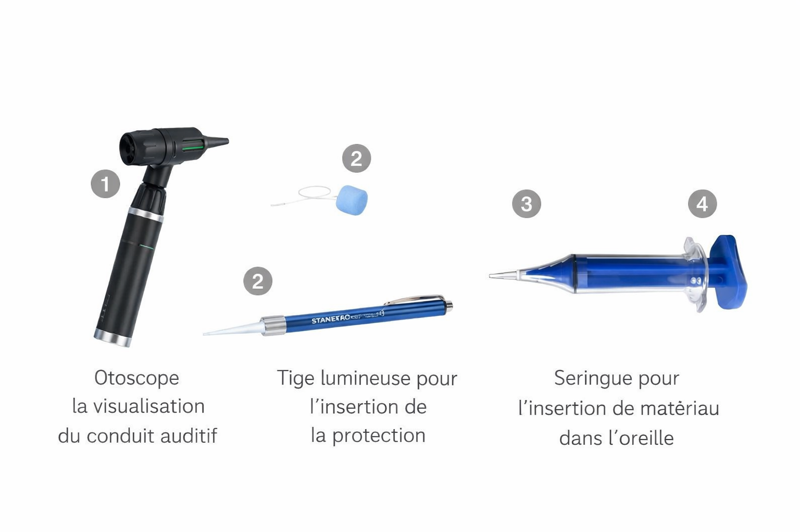
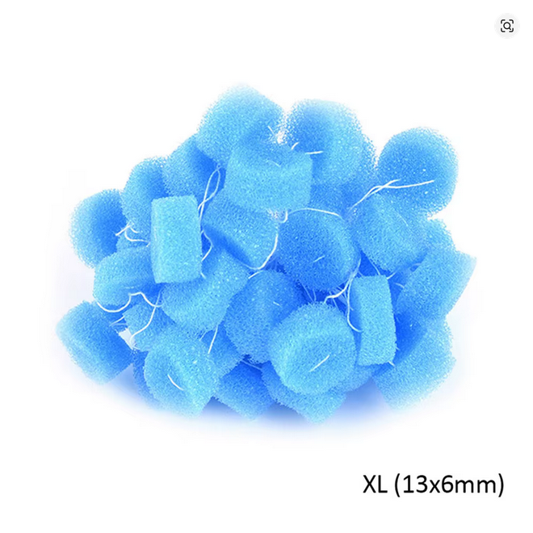
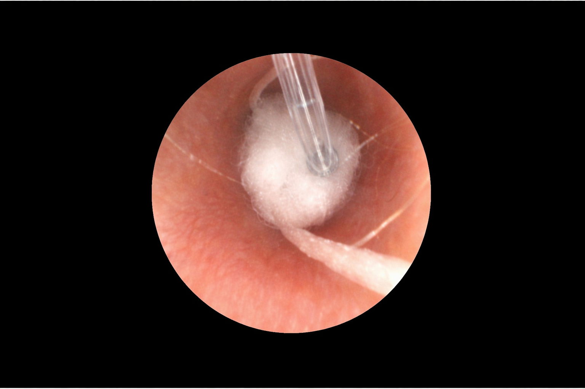
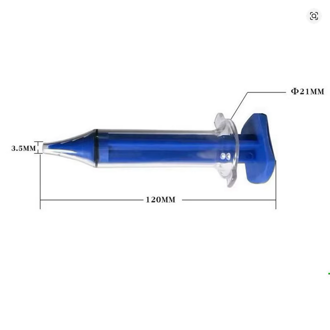
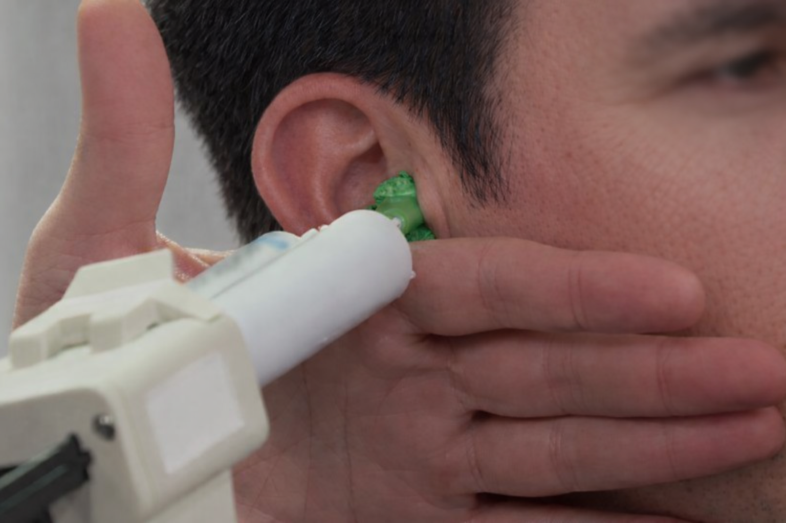
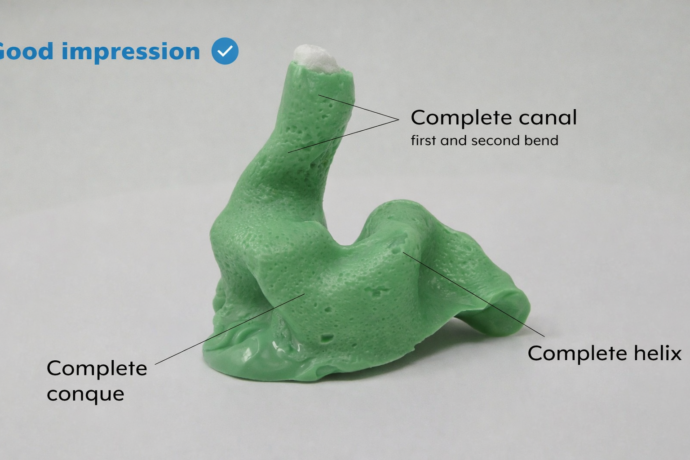

# Safety Protocol — Ear Impression Taking

**Objective:** Prevent injury, pain, infection, or blockage during the impression-taking process for custom earplugs.

This protocol applies to anyone performing ear impressions.

**Safety disclaimer.**  
Although this first trial demonstrates the practical feasibility of the molding procedure, ear-impression taking remains a potentially risky operation when performed without appropriate training, materials, or precautions. Any attempt to reproduce this procedure is done entirely at the user’s own risk. For safety reasons, ear impressions should preferably be taken by a qualified professional such as an audiologist or hearing-care specialist.

### Required Equipment for Ear Impressions

1. **Otoscope** for visualizing the ear canal
2. **Lighted insertion tool** for placing the protective dam (otoblock)
3. **Absorbent cotton or protective foam**
4. **Syringe or injection tip** for introducing the material into the ear

---

## A. Pre-Check Checklist (Before the Procedure)

Before any handling:

- ☐ No reported ear pain
- ☐ No visible infection, discharge, redness, or inflammation
- ☐ No known history of perforated eardrum or ear surgery
- ☐ Visual inspection of the ear canal with an **otoscope**
- ☐ No earwax blockage
- ☐ Ear canal is clean and dry

**If any abnormality is detected, stop the procedure immediately.**

- Ask the subject to **keep their mouth naturally closed and relaxed, without clenching their teeth** once the material has been injected.

---

## B. Physical Protection

### B.1 Otoblock / Protective Barrier

- ☐ Use a **cotton otoblock** (recommended) or medical foam
- ☐ Flare the cotton slightly before insertion
- ☐ Insert under otoscopic control
- ☐ Position it **beyond the second bend** of the ear canal
- ☐ Ensure there is no contact with the eardrum
- ☐ Check the seal to confirm there is no peripheral gap

### B.2 Depth Control

- ☐ Keep your hand braced against the subject's head
- ☐ Lift the pinna and pull the tragus forward
- ☐ Re-check with the otoscope after insertion

---

## C. Personal Protective Equipment (PPE) and Hygiene

- ☐ Disposable gloves
- ☐ Disposable mixing tips
- ☐ Clean syringe
- ☐ Disinfected tools
- ☐ Clean workstation
- ☐ New otoblock for each ear

## Mixing and Injection Protocol (2 to 3 Minutes Total)

1. **Prepare:** Wear gloves and work on a clean surface. Measure two equal portions, about one spoonful of each paste (around 7 g each, using the white spoons if provided): the base paste (often white or blue) and the catalyst (green or white).
2. **Mix the pastes:** Knead vigorously for 30 to 60 seconds between your fingers, or with a spatula on a plate, until the color is uniform and free of streaks. Work quickly at room temperature, ideally below 25 C, to avoid accelerated curing.
3. **Check consistency:** The material should be malleable but still flowable. If it becomes too hard, discard it because the ratio or temperature was incorrect.
4. **Load the syringe:** Insert the piston stopper at the bottom. Pack the silicone tightly from the tip side to avoid air bubbles until the syringe is full, then attach the fine or intra-aural tip.
5. **Inject:** As soon as mixing is complete, with a working time of about 1 to 2 minutes, inject slowly using circular movements from the deep part of the canal outward while the timer is running.

---

## D. Safe Material Injection

- ☐ Insert the tip slightly into the ear canal
- ☐ Wait for material flow before full filling
- ☐ Inject slowly using circular movements from the deep canal outward
- ☐ Fill the canal, concha, tragus, and helix

---

## E. Curing Phase

- ☐ Wait 5 to 8 minutes
- ☐ Subject remains still
- ☐ No talking, chewing, or yawning
- ☐ Monitor for any pain

---

## F. Safe Removal

- ☐ Check that the silicone has hardened
- ☐ Gently pull the ear forward
- ☐ Ask the subject to make a chewing motion
- ☐ Rotate the impression toward the nose
- ☐ Pull slowly while holding the thread
- ☐ Perform a final inspection of the ear canal

---

## G. Emergency Procedures

### Pain

- Stop immediately
- Do not continue injecting
- Perform an otoscopic inspection
- If pain persists, refer for medical evaluation

### Material Stuck in the Ear

- Do not force removal
- Attempt to break the suction seal
- If unsuccessful, refer to an ENT specialist or emergency care

**Emergency Contact:**

- Emergency services: 115

---

## H. Final Validation

- ☐ Ear canal is clean
- ☐ No discomfort reported
- ☐ Impression is intact
- ☐ Subject is comfortable

---
