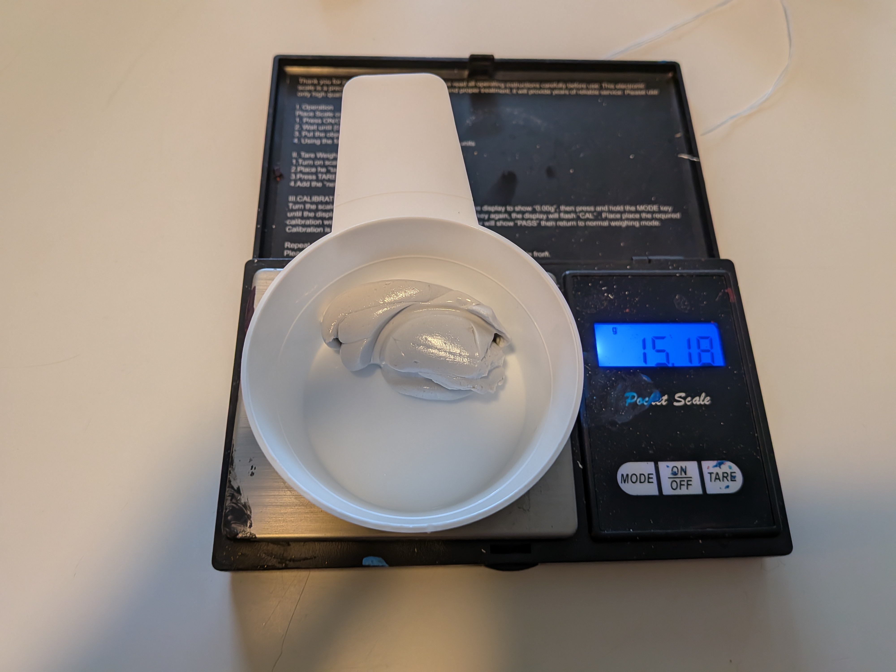
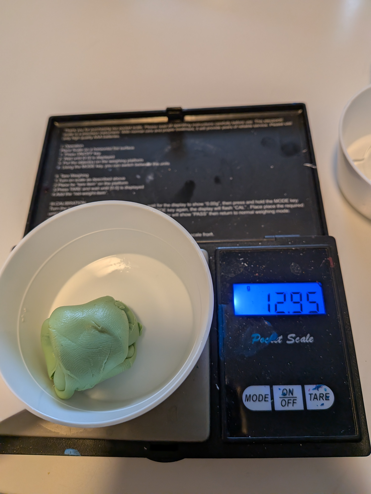
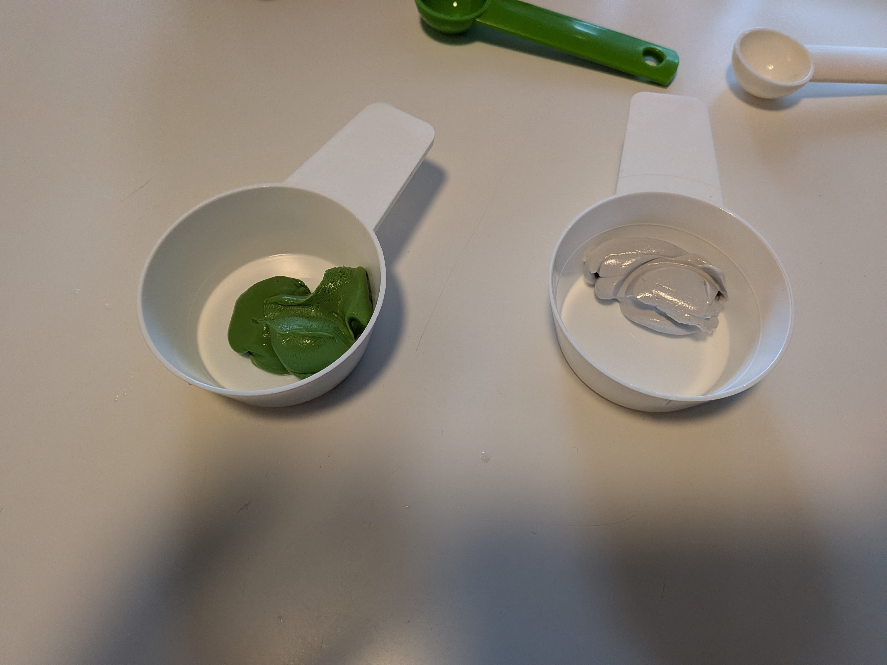
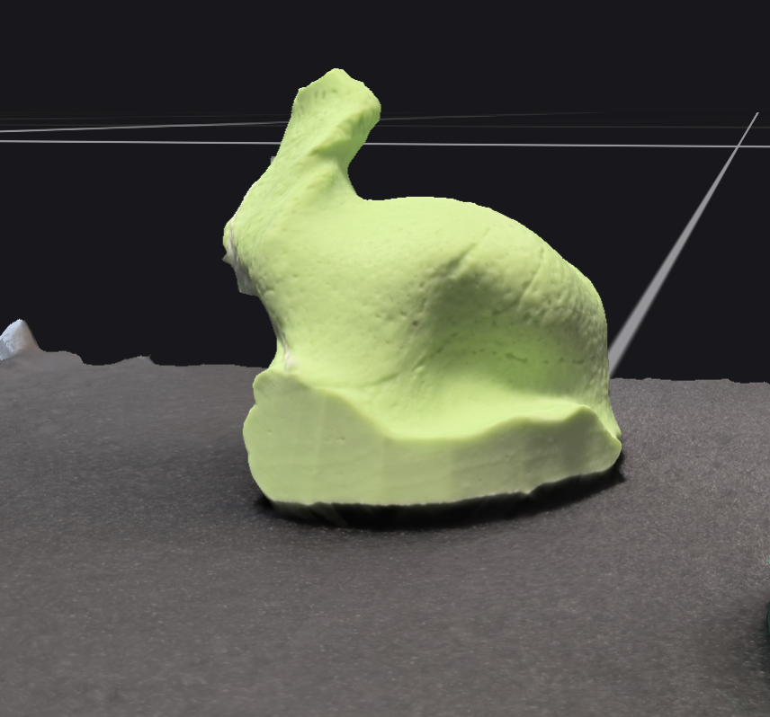

# LOT 2 - Ear Impressions

**Safety disclaimer.**  
Although this first trial demonstrates the practical feasibility of the molding procedure, ear-impression taking remains a potentially risky operation when performed without appropriate training, materials, or precautions. Any attempt to reproduce this procedure is done entirely at the user’s own risk. For safety reasons, ear impressions should preferably be taken by a qualified professional such as an audiologist or hearing-care specialist.

This note presents the first ear-impression trial carried out to assess the practical feasibility and visual quality of the silicone molding process. The objective was to verify that the preparation, mixing, and in-ear application procedure could produce stable impressions with a shape suitable for later analysis and development.

## Preparation and Injection

The images below illustrate the preparation of the two-part silicone before injection, including weighing and mixing of the components.

  
  
  

## Impression Result

The following images show the in-ear material during application and the final impression result. The obtained shape confirms that the procedure is operational and can produce a usable ear geometry. This result is mainly qualitative at this stage, but it provides a practical basis for future iterations and more controlled acquisition campaigns.

  
  
  

## Reference

Useful resource on ear-impression technique and evaluation:

https://www.youtube.com/watch?v=MqbyFqYKj7s
