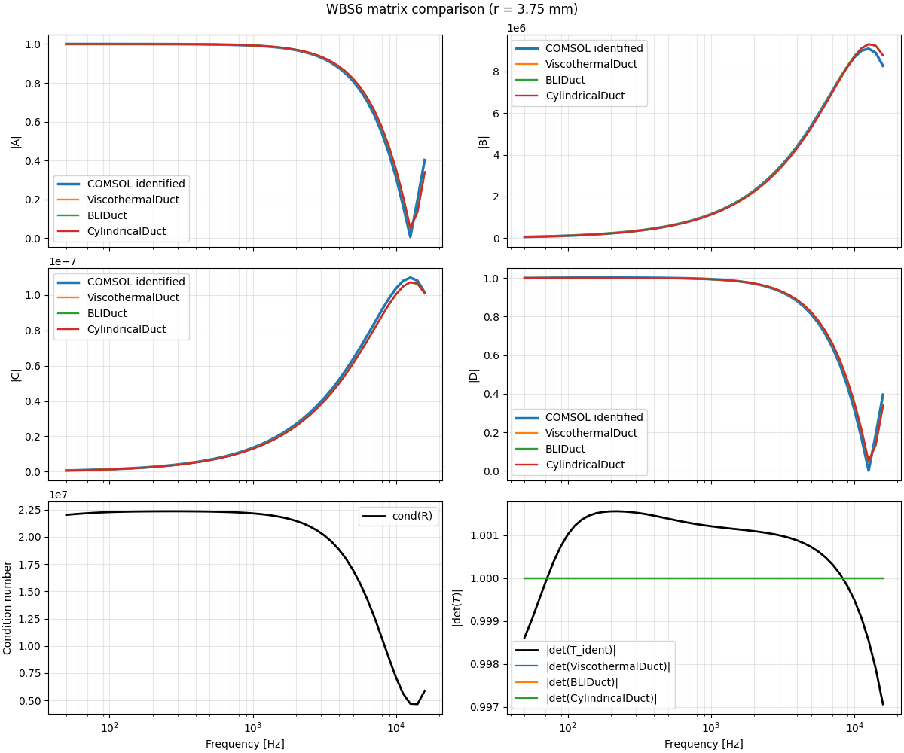
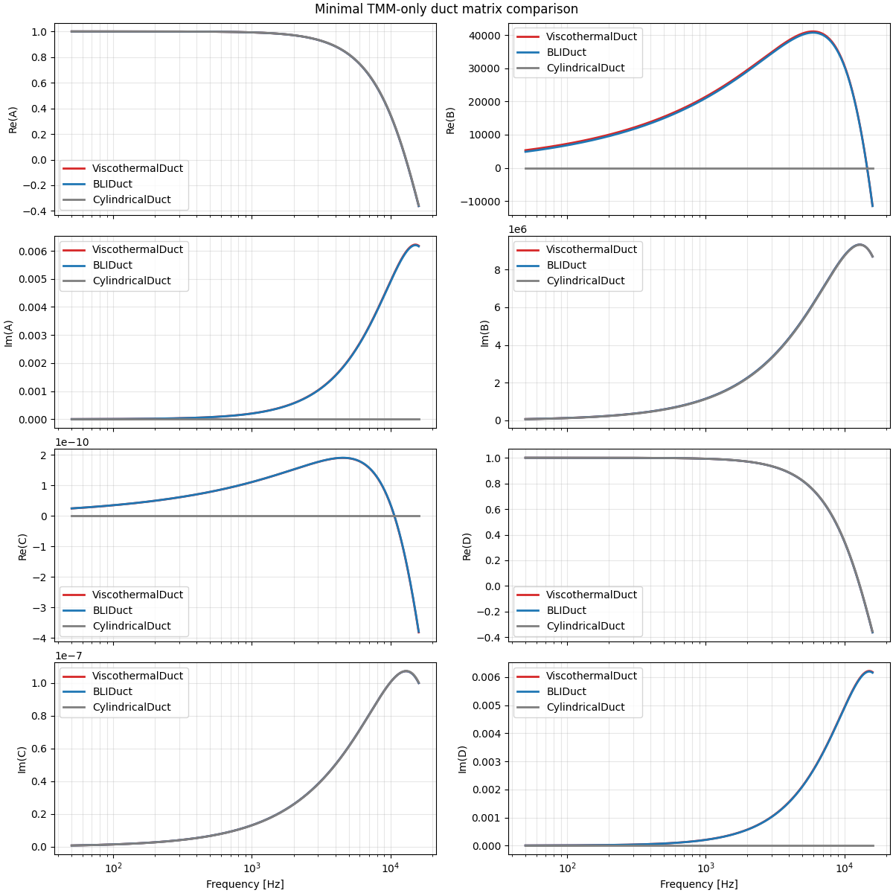
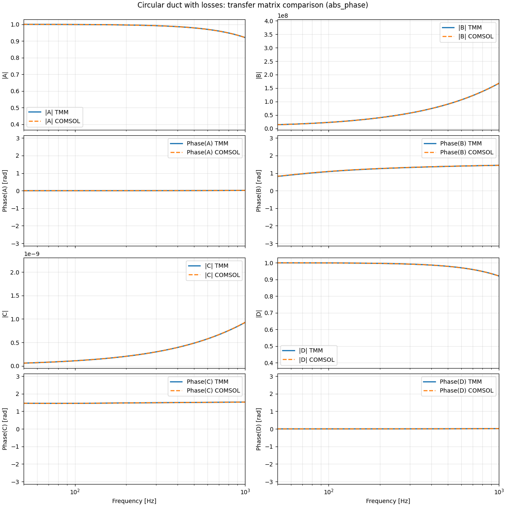

## WBS 6 Report Note

WBS 6 focuses on one of the basic ingredients needed for earplug simulation: validation by FEM of narrow circular ducts with thermoviscous losses.

After the previous work packages established matrix conventions and identification tools, this step checks whether the toolbox can represent a dissipative duct consistently and whether the reduced TMM description remains close to the FEM reference.

The goal here is not yet to model a full filter. It is to validate the lossy-duct building block itself, because this element appears repeatedly later in the rigid holder, in the earplug internal channels, and in the reduced filter models.

### `B1_compare_fem_identified_vs_tmm_lossyduct.py`

This script compares FEM-identified lossy-duct matrices with standard TMM duct models for two radii. Two load cases are used to identify the equivalent two-port from FEM, then the identified matrix is compared against `ViscothermalDuct`, `BLIDuct`, and the lossless `CylindricalDuct`. The comparison is done both at matrix level and at the level of reconstructed inlet pressure, which makes it possible to judge whether the dissipative duct model is accurate enough for later use.
Which is fine.

  

### `B2_minimal_tmm_matrix_pressure_compare.py`

This is the reduced TMM-only version of the previous comparison. It does not use FEM data; instead, it compares the three duct models directly in terms of transfer-matrix coefficients and rigid-end pressure. The script is mainly used to understand the differences between the available duct formulations and to isolate their effect without the extra complexity of the FEM identification chain.

  

### `B3_Verif_Basic_Circular_duct_withlosses.py`

This script validates the viscothermal circular duct against FEM S-parameter data with the port load item in the fem simulation. Using the port load item one can directly obtain the TMM matrix then comparison is performed on transfer-matrix coefficients, rigid/open-end pressures, and reflection-transmission-absorption quantities.
It therefore gives a direct physical check that the dissipative circular-duct element implemented in the toolbox reproduces the reference behavior with near identical result. 

  

## Conclusion

WBS 6 validates the lossy circular duct as a reliable reduced element for the rest of the project. The main outcome is that a thermoviscous TMM description is able to reproduce the FEM reference much better than a lossless duct, which justifies using viscothermal duct elements in the later earplug and filter models.
