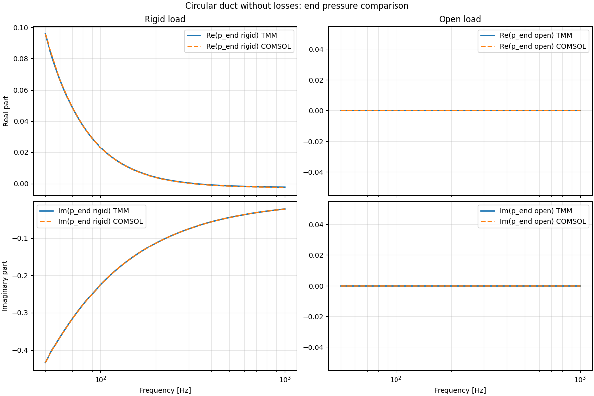
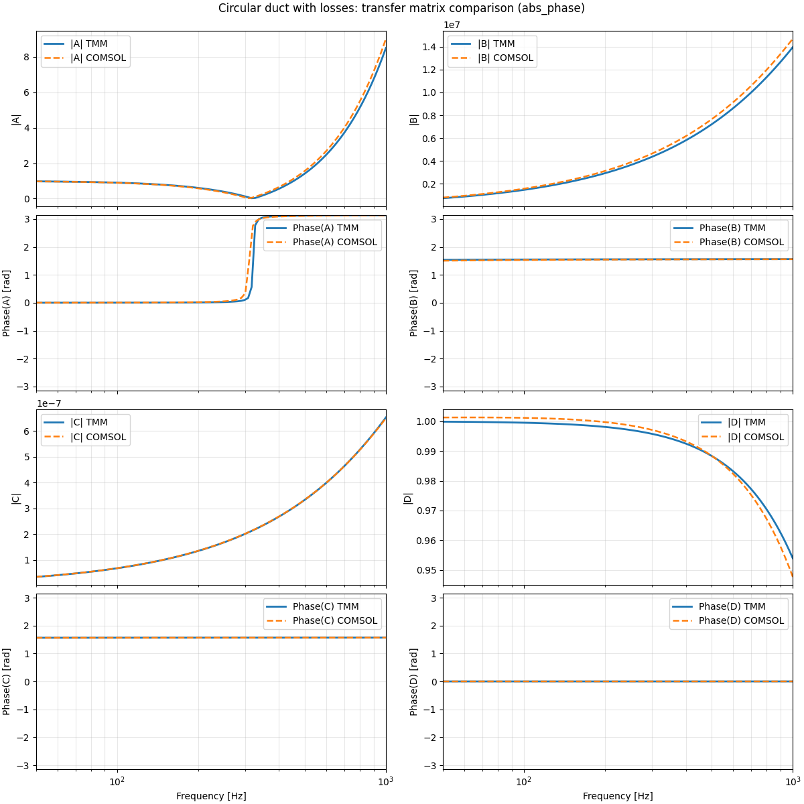
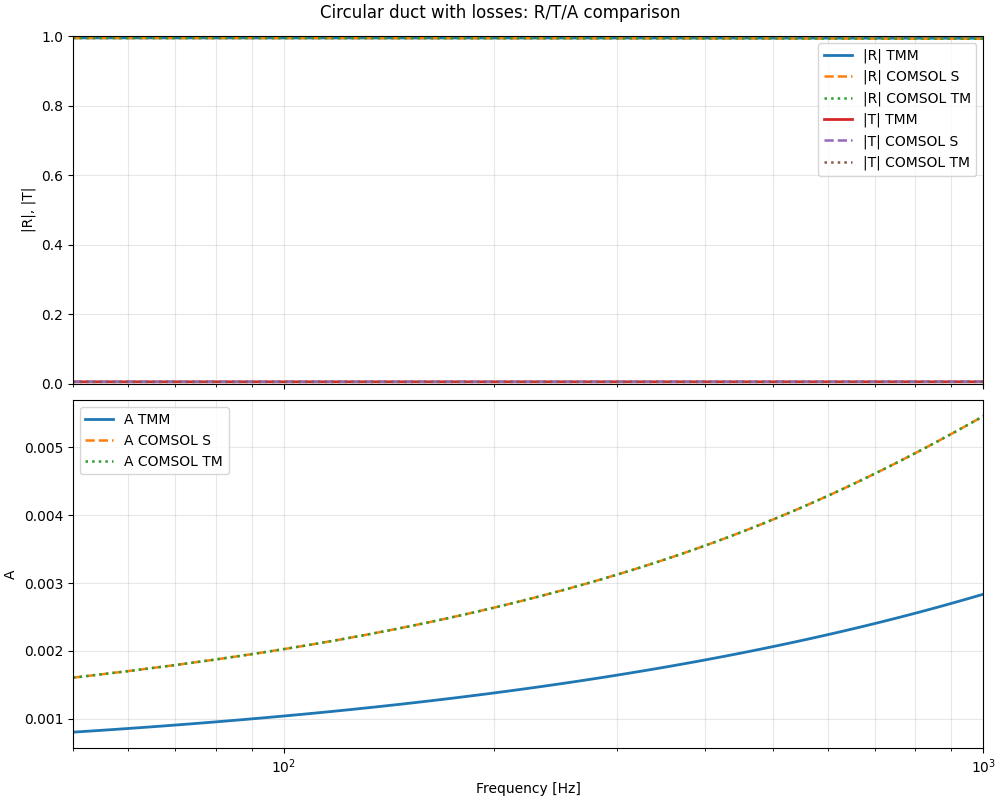
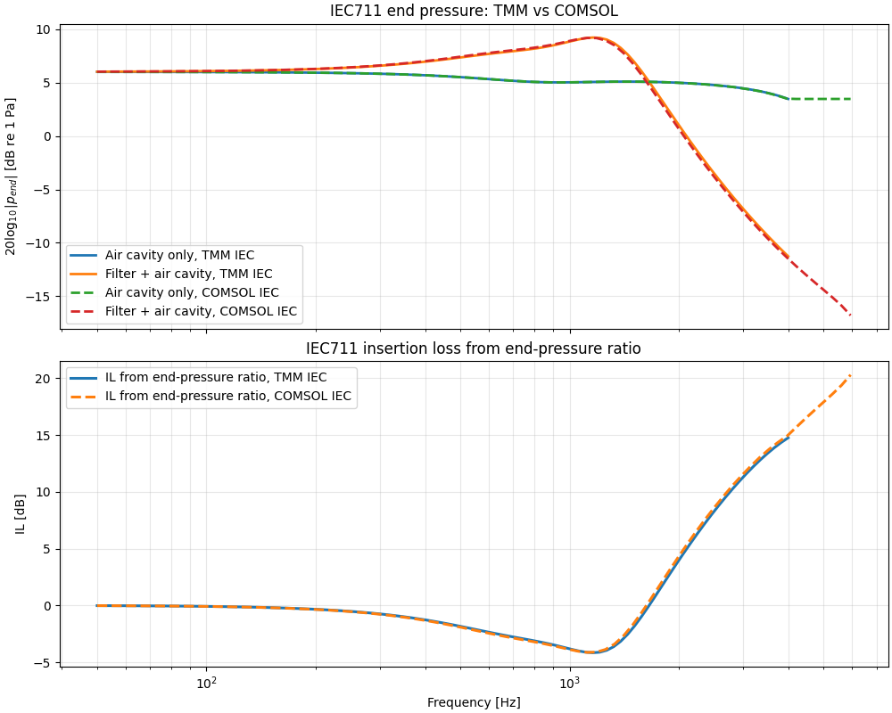

## Summary of the validation study wbs 7

A Python validation workflow was developed to compare a transfer-matrix model (TMM) of a circular/conical duct system against FEM results. The objective was to check whether the analytical/numerical 1D model implemented in `toolkitsd.acoustmm` reproduces the transfer behavior obtained from finite-element simulations, both in the lossless case and in the lossy case.

The studied geometry consists of an input cylindrical duct, a conical transition, and an output cylindrical duct. For the lossless case, the cone is modeled directly with `ConicalDuct`. For the lossy case, the cone is approximated by a succession of short `ViscothermalDuct` segments in order to include thermoviscous effects. In both cases, FEM S-parameters are imported and converted into an equivalent transfer-matrix representation, so that the comparison can be performed on the same basis.

The comparison was carried out at three levels:

1. comparison of the transfer-matrix coefficients $A$, $B$, $C$, and $D$,
2. comparison of the pressure reconstructed at the end of the system for rigid and open loads,
3. comparison of reflection, transmission, and absorption.

## Main results

### Lossless case

For the lossless configuration, the TMM and FEM transfer matrices are in very good agreement over the full frequency range. The coefficients $A$, $B$, $C$, and $D$ are almost identical, with only a small deviation that becomes slightly more visible at higher frequencies. This may indicate a minor discrepancy between the TMM and FEM definitions or constants, rather than a fundamental modeling error.

The end pressures reconstructed from both models are also nearly identical, for both rigid and open terminations. As a consequence, the reflection and transmission results match extremely well. Absorption remains essentially zero, as expected in the lossless case, and the small nonzero values observed are negligible and likely due to numerical error or slight inconsistencies in parameter definitions.

  

### Lossy case

For the lossy configuration, the same overall conclusion holds: the transfer matrices obtained from the discretized viscothermal TMM and from FEM remain very close. The reconstructed end pressures again show an excellent agreement, confirming that the lossy conical approximation is consistent with the FEM reference.

Reflection, transmission, and absorption are also in good agreement between the two approaches. In contrast to the lossless case, the absorption is no longer exactly zero, which is physically expected since thermoviscous losses are now included. However, the absorption remains very small, on the order of $10^{-3}$, meaning that losses are present but weak for the considered geometry and frequency range.

  

  

## Cone + cavity configuration

For the cone–cavity configuration, the TMM again shows good agreement with FEM. The filter mainly acts by modifying the cavity response rather than by introducing strong dissipation, which leads to a frequency-dependent insertion loss that is also sensitive to the output load.

  

## Conclusion

Overall, the program successfully validates the TMM implementation against FEM for both lossless and lossy conical duct configurations. The agreement is very good at the matrix level, at the pressure reconstruction level, and at the level of energetic quantities. The lossless case confirms the consistency of the transfer formulation, while the lossy case shows that the segmented viscothermal approximation provides a reliable extension of the model with only weak but physically meaningful absorption.
