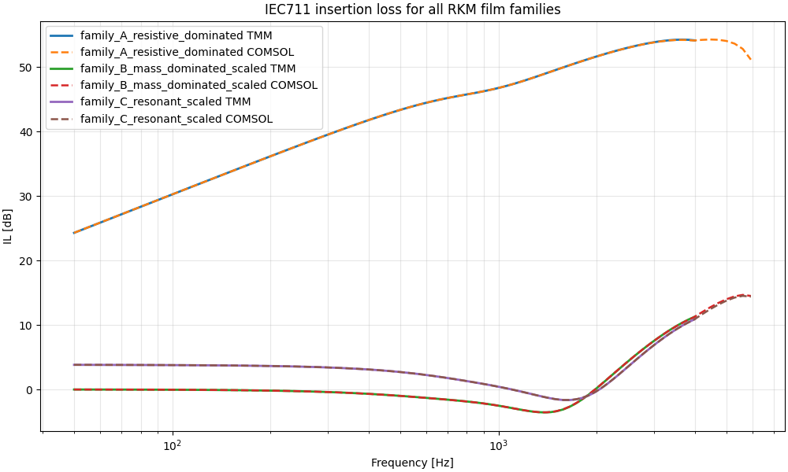
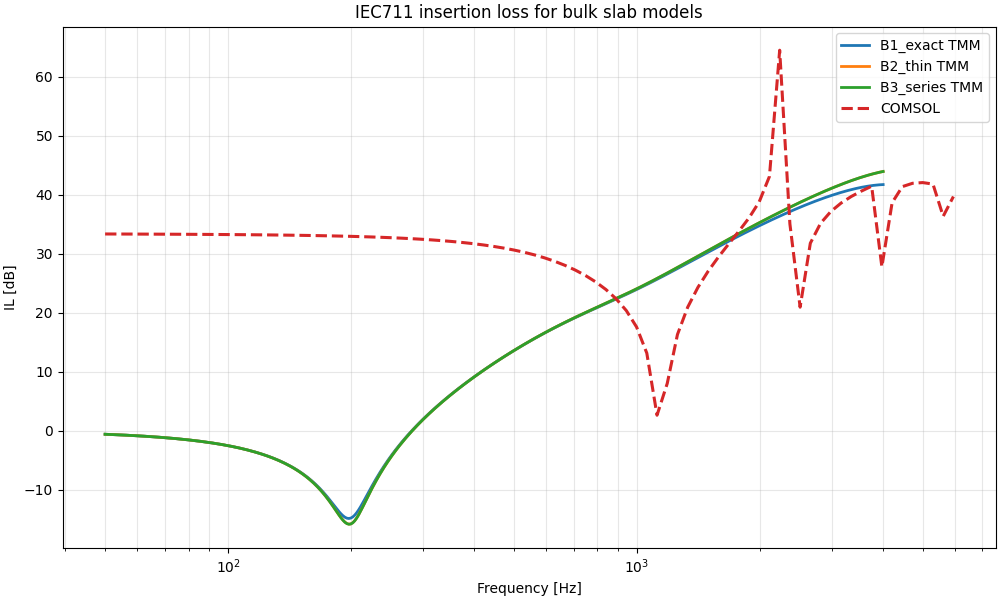
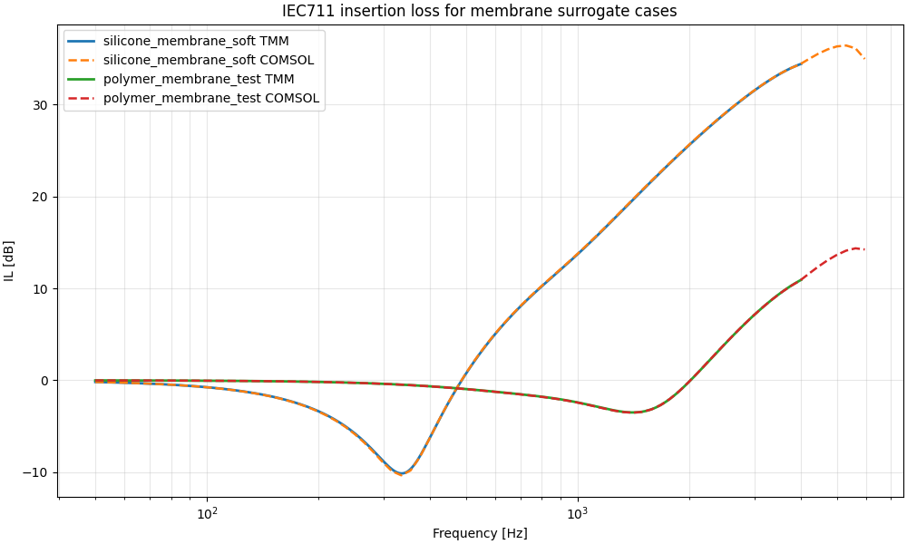
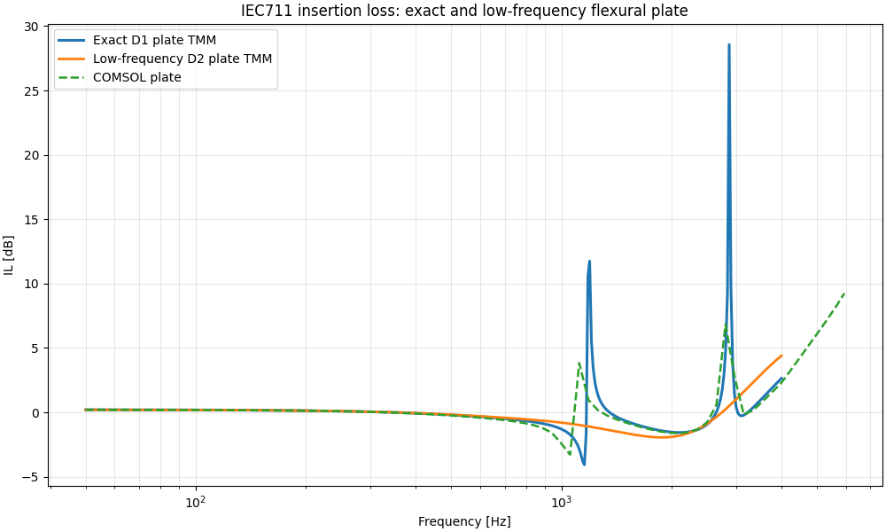

## A0 to A2 — Reference validation cases

**Comment:**
Cases **A0 to A2** show an excellent agreement between **FEM** and **TMM**. These cases can therefore be considered as **validated reference configurations** for the study.

The match indicates that:

* the **transfer-matrix implementation** is correct for these configurations,
* the **FEM setup** is also consistent,
* and the comparison procedure itself is reliable.

These cases provide a solid baseline for the more advanced structural or effective-element models that follow.

---

## A3 — Bulk-modulus surrogate / compressible slab-type model

**Comment:**
Case **A3** is noticeably less successful. A clear discrepancy remains between **FEM** and **TMM**, especially at low frequency.

In practice, the **TMM model behaves more like an infinite or weakly laterally unconstrained slab**, while the **FEM result exhibits a stronger blocking behavior**. In other words, the TMM does not reproduce the pressure-blocking effect observed numerically.

At first, this discrepancy was interpreted as a consequence of **lateral constraint effects**: the idea was that TMM, being fundamentally **1D**, could not represent the condition of suppressed lateral motion along the sides of the slab, which in FEM could stiffen the response and lead to a more blocking behavior.

However, the situation is not fully resolved, because:

* in **2D FEM**, changing the slab-side constraint condition (**free / constrained / roller / etc.**) did **not** significantly modify the result,
* whereas in **3D FEM**, the behavior was more in line with the original expectation:

  * **free-like constraint** gave a result closer to TMM,
  * **fixed constraint** produced the stronger blocking-pressure behavior.

So the interpretation is now less straightforward. The discrepancy may come from one or several of the following:

1. a **true limitation of the 1D TMM representation** for this case,
2. a **difference between 2D and 3D structural kinematics**,
3. a possible **mismatch in how boundary constraints are effectively realized in the FEM 2D model**,
4. or more fundamentally, the fact that this problem may not admit a clean 1D equivalent in the chosen formulation.

For the first pass, i'll stop there and ask help to someone with better knowledge there.

## A4 — Membrane surrogate model

**Comment:**
Case **A4** works well in practice: the surrogate model reproduces the membrane behavior satisfactorily.

However, this agreement should be interpreted with caution. The model behaves somewhat like a **fitted reduced-order RKM-type representation**, in the sense that:

* $E$ and $\rho$ are adjusted,
* and the tension contribution is tuned through the chosen correction term / control parameter.

So the model is effective, but it is not fully predictive from first principles. Its strength is mainly that it provides a **useful and compact equivalent model** for the membrane response.

---

## A5 — Exact flexural plate / Bessel-based structural model

**Comment:**
Case **A5** is globally very successful, but not perfect. The main discrepancy is a **frequency shift** between the **FEM result** and the **exact TMM plate model based on the Bessel formulation**.

This shift is significant enough that it cannot be ignored, even though the overall behavior remains strongly consistent. In particular:

* the **low-frequency response** agrees very well,
* the global shape and physical trend are coherent across models,
* but the resonance position is offset.

At this stage, the most likely explanation is **not** that the Bessel-based TMM model is fundamentally wrong, but rather that the **boundary conditions and effective constraints in FEM do not exactly correspond to those assumed in the analytical plate model**.

This is especially plausible for flexural plate problems, where resonance frequencies are highly sensitive to:

* edge condition type (**clamped / simply supported / partially constrained / numerically stiffened**),
* shell/plate formulation details,
* coupling with the surrounding acoustic domain,
* and possible local stiffness contributions introduced by the numerical setup.

So A5 should be interpreted as a **good physical validation with boundary-condition sensitivity**, rather than a strict one-to-one resonance match.

For the first pass, i'll stop there and ask help to someone with better knowledge on fem there.

---

## Global synthesis

> Cases A0–A2 validate the common acoustic framework with excellent FEM/TMM agreement.
>
> Case A3 remains problematic and reveals an unresolved issue related to the reduced 1D representation of a laterally constrained compressible element.
> 
> Case A4 shows that a calibrated surrogate membrane model can reproduce the observed response well, although in a fitted rather than strictly predictive sense.
> 
> Case A5 provides a strong validation of the flexural-plate approach, with very good overall agreement and only a residual frequency shift, likely attributable to boundary-condition mismatch between FEM and the analytical model.
