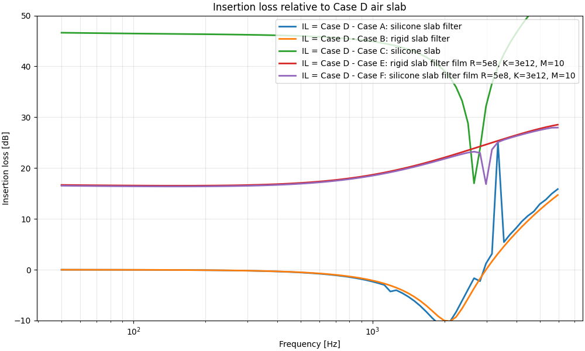
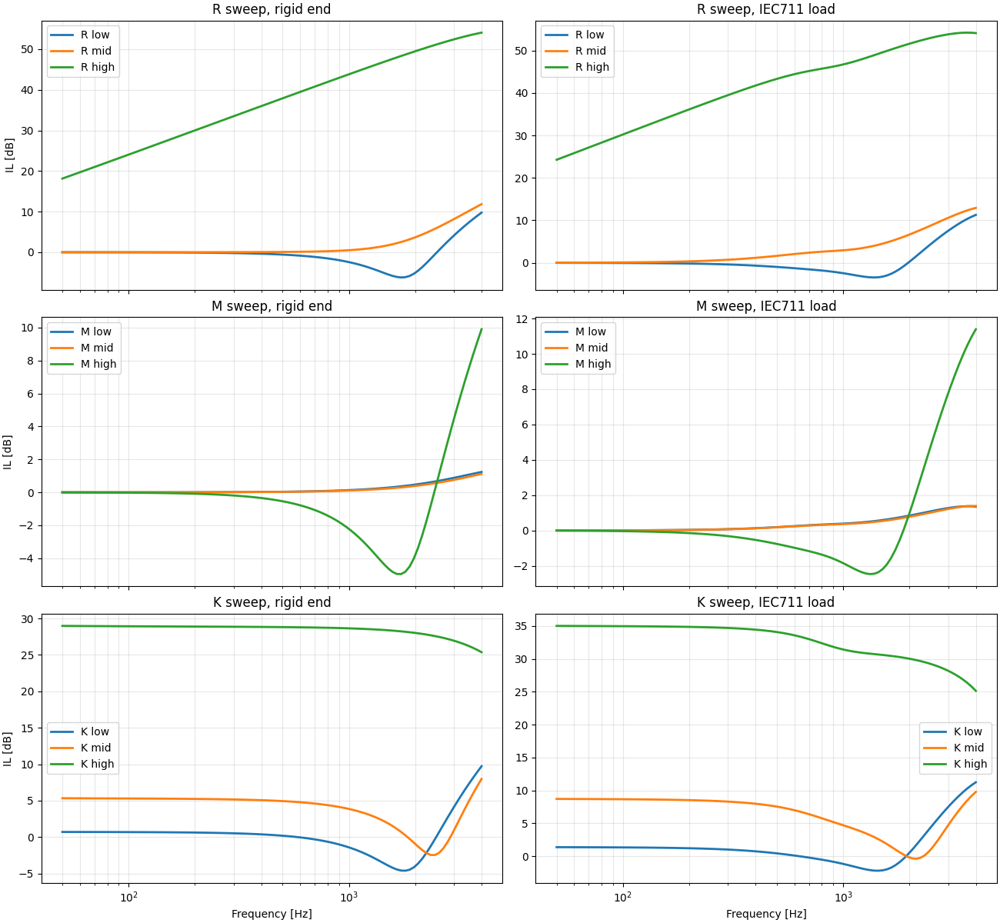
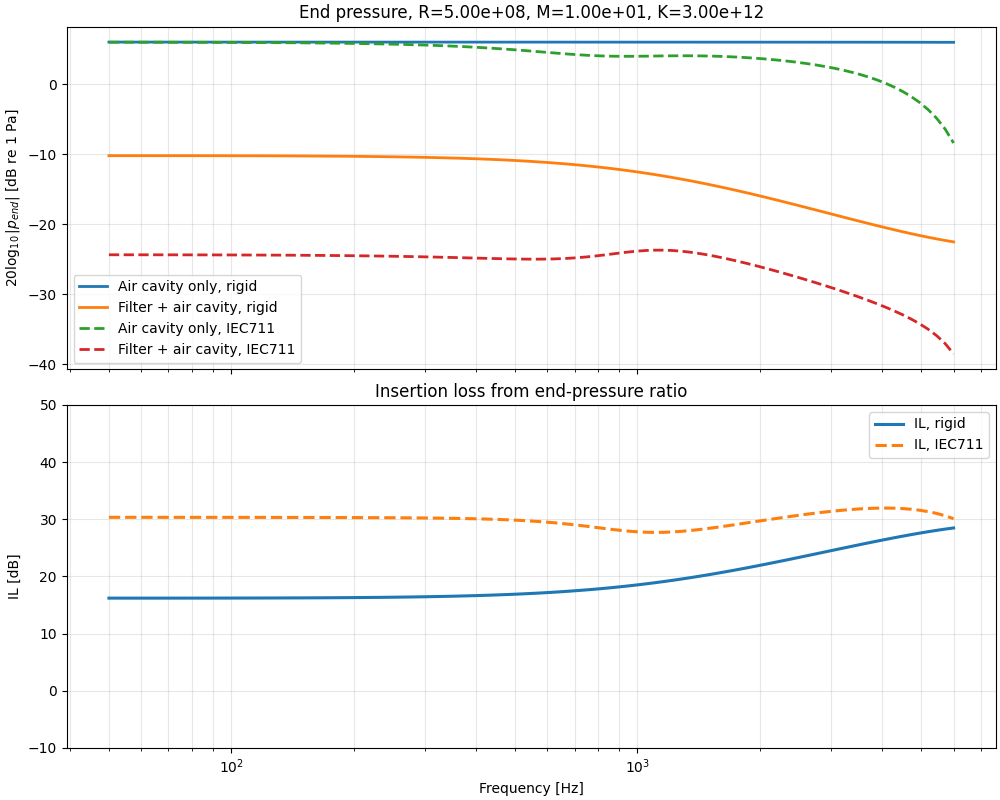
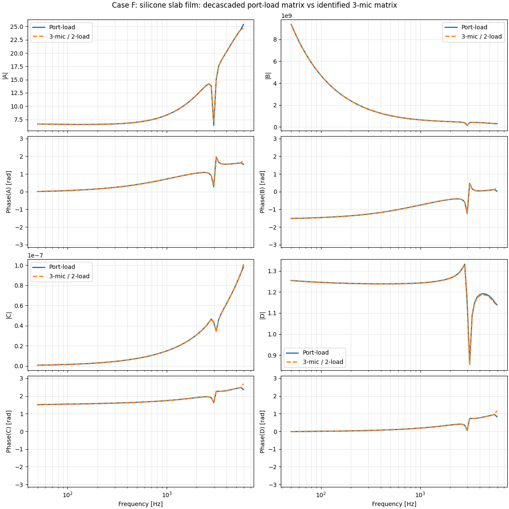
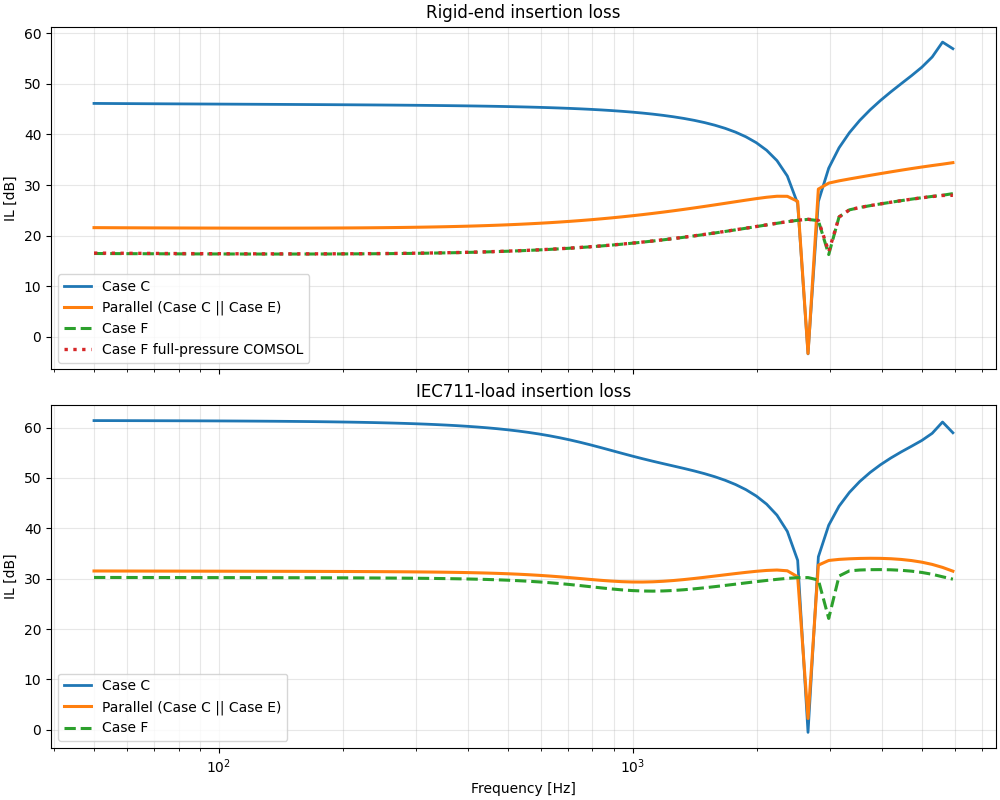

# WBS 10 Report Note

## Objective

WBS 10 aims to build a reduced model of the full occluding system obtained by combining the silicone slab and the filter. According to [lot5.md](/media/nuopel/DATA/ProjectsAndTools/1_Projects/Acoustic/PRJ12_BO/LOT5_acoustic_filter_simulation/lot5.md), the two candidate strategies are:

- a reduced model based on a parallel combination of slab and filter branches
- a black-box equivalent matrix identified directly from FEM for the full assembly

The purpose of the present work package is therefore to determine whether the slab and filter can be merged with sufficient accuracy through a parallel two-port formulation, or whether the full assembly must instead be kept as an identified black-box matrix.

## Scope of the work

The work in this folder focuses on:

- computing and comparing the insertion loss of several slab / filter / slab+filter configurations
- validating the FEM matrix extraction routes
- testing a parallel admittance combination for the slab and the filter
- comparing this reduced parallel model against the full FEM assembly

The main scripts are listed below in the order in which they contribute to the WBS10 conclusion.

## 1. Rigid-end IL screening from direct FEM pressure results

Script: `A0_IL_of_the_parallel_branch.py`

This script loads rigid-end microphone results from FEM and computes the insertion loss relative to the air reference tube (`Case D`).

It provides a first screening of the candidate configurations:

- `Case A` and `Case B`, corresponding to the initial straight filter concept, are too transparent and provide insufficient attenuation
- `Case C`, the silicone slab alone, shows the expected cavity-controlled resonance in the mid-frequency range
- `Case F`, the slab+filter+film configuration, gives a stronger response but also shows that the full coupled system is not a trivial superposition of the slab and the filter taken separately

This first step already suggested that a simple parallel combination might be too optimistic because the slab and the filter interact acoustically inside the complete assembly.

## 2. Exploratory tuning of the film branch

Scripts:

- `A1_RKM_in_duct_iec_or_rigidend.py`
- `A1_RKM_single_config.py`

These scripts were used as fast exploratory tools to tune the equivalent film branch through resistance, mass, and stiffness parameters.

`A1_RKM_in_duct_iec_or_rigidend.py` was used to visualize the effect of parameter families and identify useful orders of magnitude for the film branch.

`A1_RKM_single_config.py` was then used as a simpler one-configuration tuning script for the values retained in the FEM test cases.

At this stage the film parameters should be understood as convenient equivalent test values rather than fully validated physical film properties. A more physical identification of these quantities will need to be supported later by measurements.

## 3. Validation of the FEM matrix extraction

Scripts:

- `B1_load_fem_port.py`
- `B1_wb5_3mic_method_cases.py`
- `B2_compare_port_vs_3mic_matrices.py`

Two independent matrix-identification routes were compared:

- extraction from FEM port loads and S-parameters
- identification from the three-microphone / two-load method

`B1_load_fem_port.py` and `B1_wb5_3mic_method_cases.py` were first used to verify each route separately. The air-slab case (`Case D`) was also compared against the corresponding viscothermal TMM duct and showed excellent agreement, which gives confidence in the extraction conventions and de-embedding procedure.

`B2_compare_port_vs_3mic_matrices.py` then compared both identified matrices case by case.

For all tested cases, both approaches give nearly identical transfer matrices. This is an important validation result for WBS10 because it confirms that the reduced two-port description itself is consistent and that the remaining discrepancy comes from the physical modeling choice, not from the identification workflow.

## 4. Parallel-branch test

Script: `B3_parallel_matrix_test.py`

This script tests the newly implemented parallel matrix composition in the toolbox. The reduced parallel branch is built by combining:

- `Case C`: silicone slab
- `Case E`: rigid slab filter + film

through a parallel admittance combination, and the resulting equivalent matrix is compared with:

- `Case F`: full slab+filter+film assembly from FEM

The script also compares insertion loss under:

- rigid-end loading
- IEC711 loading

and overlays the rigid-end reference IL obtained directly from the full-pressure FEM simulation.

The parallel matrix formulation is technically valid and has now been implemented in the framework. It is useful as a reduced and fast approximation when two true branches connect the same upstream and downstream acoustic nodes.

However, for the present earplug configuration, the parallel combination of the slab and the filter does not reproduce the full FEM assembly accurately enough. The comparison of the parallel result with `Case F` shows that:

- the parallel model overestimates the attenuation, especially under rigid-end loading
- the interaction between the slab and the filter is not negligible
- the complete assembly cannot be represented reliably as a simple uncoupled parallel superposition

Under IEC711 loading, the discrepancy is smaller and remains of practical interest for quick exploratory studies, but the rigid-end comparison shows that the branch interaction is still significant.

The practical conclusion is therefore consistent with the WBS10 decision recorded in `lot5.md`:

- the parallel admittance model is kept as a useful reduced approximation and framework utility
- the full assembly should be represented for now by its black-box equivalent FEM matrix when accurate prediction is required

## Consequence for the next step

This result motivates the next stage of the work: extracting equivalent effective properties for the silicone slab that can later be inserted into a more appropriate lined-duct or coupled-duct formulation. The goal is to retain the modularity and speed of a reduced model while capturing the interaction effects that are missed by the simple parallel-branch approximation.
