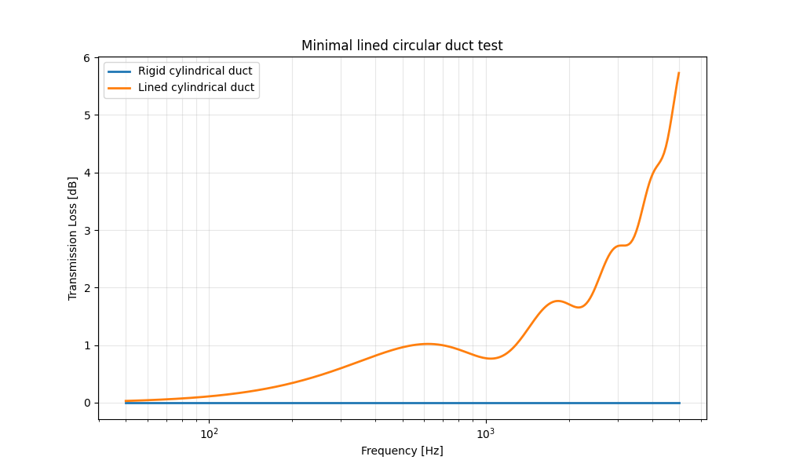
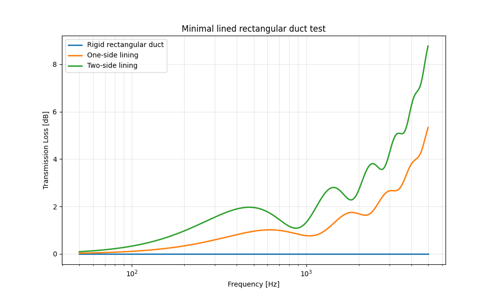
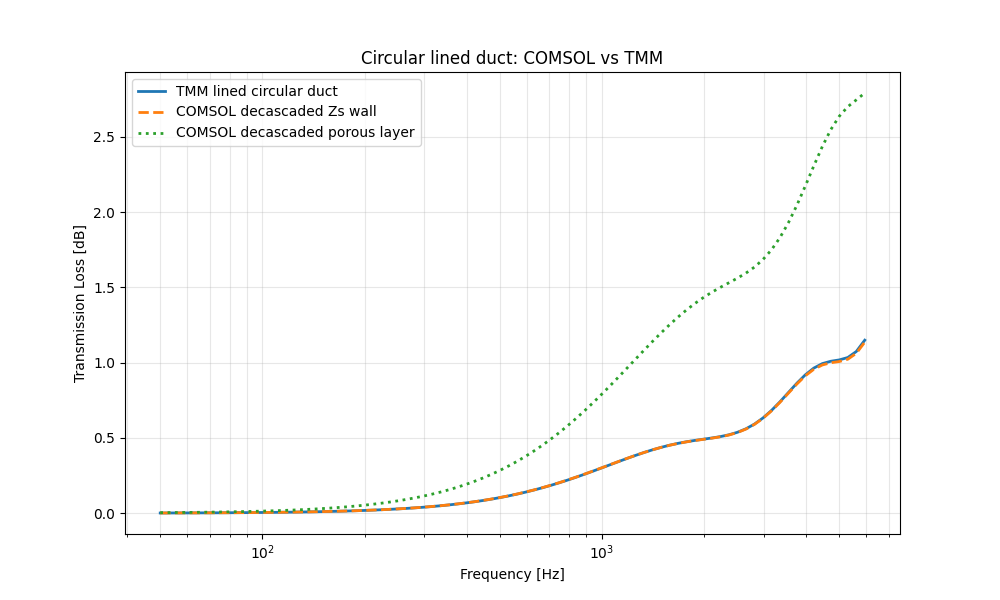
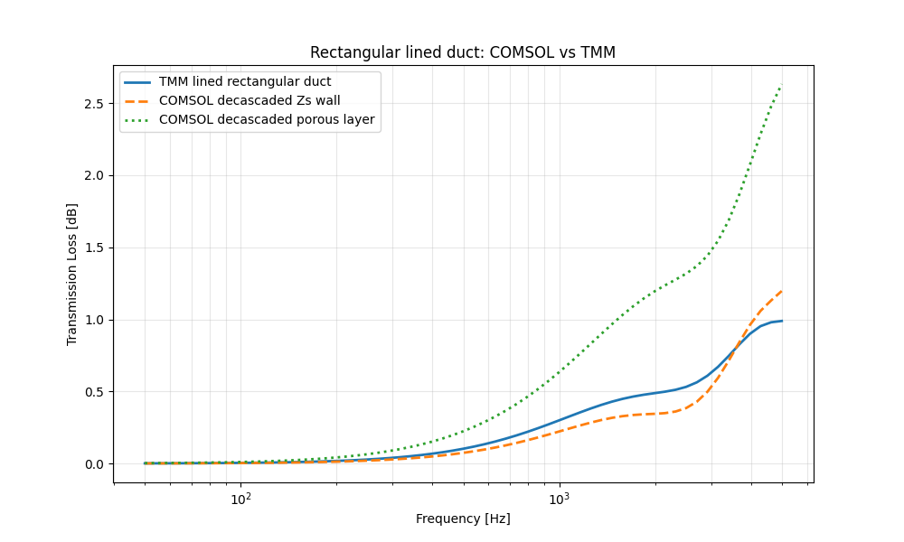
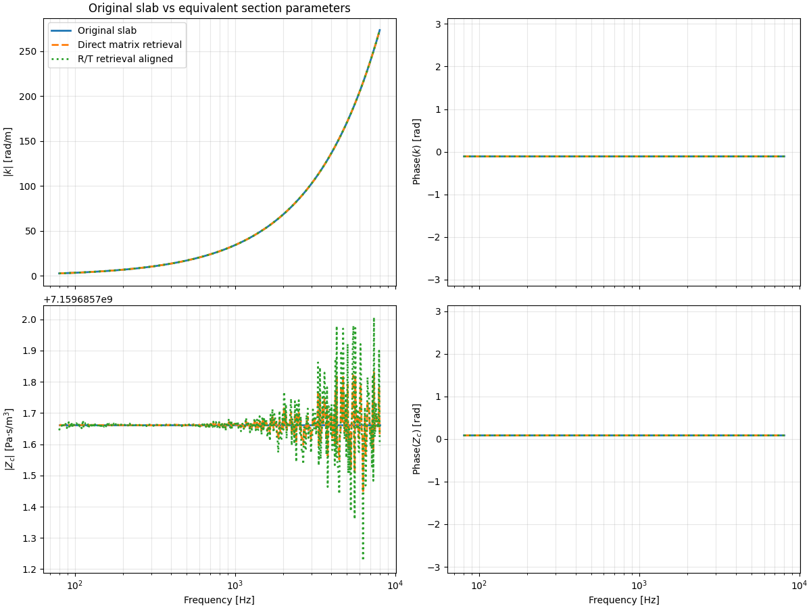
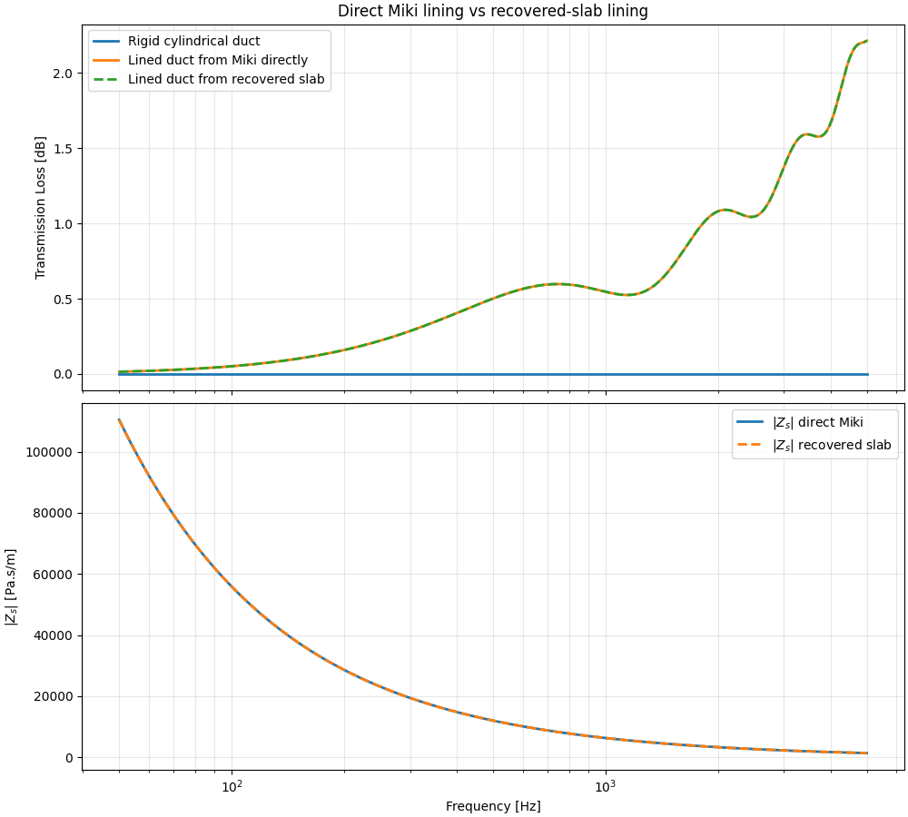
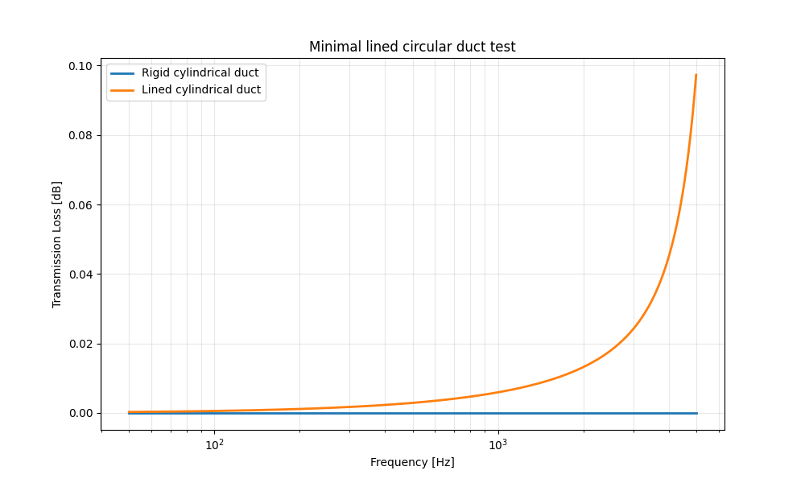
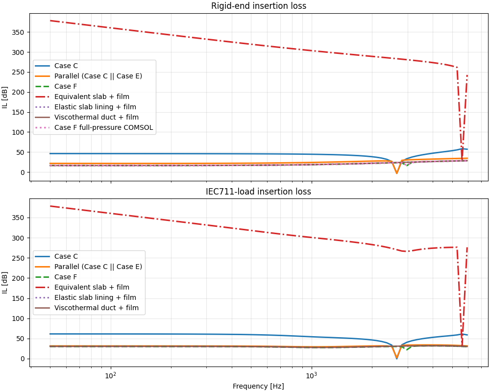

## WBS 11 Report Note

WBS 11 follows directly from the conclusion of WBS 10. The simple parallel reduction of the slab and filter branches was not sufficiently predictive, which motivated the search for another reduced description able to retain more of the dissipative behavior while remaining compact and reusable in TMM.

The strategy explored here is based on **lined-duct modeling**. The first step is to validate whether a locally reacting lined-duct formulation can reproduce reference FEM results for circular and rectangular ducts. The second step is to test whether an isolated slab can be reduced to equivalent propagation parameters $(k_{eq}, Z_{c,eq})$, then reinterpreted as an equivalent lining through a rigidly-backed wall impedance.

This WBS therefore addresses two distinct but connected questions:

1. can a lined-duct reduced model provide a useful representation of dissipative duct sections for the present application?
2. can slab-equivalent parameters extracted from porous, elastic, or fem-derived slab matrices be transferred reliably into such a lined-duct model?

The scripts below document both the positive results and the limitations of this approach.

`A0_minimal_lined_circular_duct.py` and `A0_minimal_lined_rectangular_duct.py`

  
  

  Minimal lined duct validation cases. The insertion loss (IL) remains physically consistent: adding lining (one-side or two-side) increases attenuation in a smooth and expected manner. These examples can be considered as minimal, ready-to-use validation benchmarks for lined-duct TMM implementations.

### `A1_compare_lined_circular_duct_fem.py` and `A1_compare_lined_rectangular_duct_fem.py`

  
  

  <em>
  Comparison between TMM predictions and FEM simulations for lined ducts. A good agreement is observed in the circular case, while noticeable discrepancies appear for the rectangular configuration.
  </em>

The comparison highlights an important modeling limitation. In the circular case, the agreement between TMM and FEM is satisfactory when the lining is represented as an impedance boundary condition. This configuration relies on an axisymmetric model, which inherently restricts the physics and is well aligned with the assumptions underlying the TMM formulation.

In contrast, the rectangular duct is modeled in full 3D, where additional phenomena are present (e.g., transverse effects, edge interactions, and possible higher-order mode contributions). These effects are not fully captured by a 1D TMM with locally reacting walls, which might explains the observed discrepancies.

A second key observation concerns the material modeling. When the lining is introduced via a full 3D or 2D layer Johnson–Champoux–Allard model (JCA) instead of a precomputed surface impedance derived from the same model, the agreement degrades significantly. In this case, the TMM strongly underestimates the insertion loss compared to the FEM results.

Although the discrepancies remain moderate in magnitude, they are systematic and highlight a structural limitation of the approach. This suggests that TMM predictions should be used with caution in such configurations, especially when:

* the geometry departs from axisymmetric assumptions,
* the lining exhibits complex (non-locally reacting or bulk) behavior,
* or high accuracy is required.

In practice, this reinforces the need for systematic validation against FEM simulations (e.g., using FEM ) when extending TMM models beyond their nominal domain of validity.

---

### `A2_Slab_duct_eq.py`

  

This script verifies that the equivalent parameters extracted from a silicone slab are consistent with the expected behavior of a homogeneous transmission medium.

The workflow is intentionally minimal:

1. extract the slab transfer matrix,
2. retrieve the equivalent parameters ($(k_{eq}, Z_{c,eq})$).

This serves as a validation step to ensure that the inversion procedure is well-posed and correctly implemented.

---

This workflow is implemented in `A3_minimal_lined_circular_duct_with_miki_slab.py` and `A4_minimal_lined_circular_duct_withslab.py`.

After recovering the equivalent medium of the slab, the lining wall impedance is computed using the standard rigidly backed layer formulation, but replacing the prescribed porous model with the retrieved equivalent parameters. For a slab of thickness (t), the wall impedance writes:

$
Z_w = -j, z_{c,m} \cot(k_m t)
$

This relation provides the critical link between the **slab representation** (via its transfer matrix) and the **lined-duct model** (via a boundary impedance).

The complete workflow can be summarized as follows:

1. extract the slab transfer matrix,
2. retrieve the equivalent parameters ((k_{eq}, Z_{c,eq})),
3. interpret them as an equivalent medium ((k_m, z_{c,m})),
4. compute the corresponding wall impedance (Z_w),
5. inject (Z_w) into the lined circular duct model to compute the axial wavenumber (k_z) and the associated TMM representation.

---

`A3_minimal_lined_circular_duct_with_miki_slab.py` illustrates this approach in a controlled configuration where a reference solution is available, namely a Miki porous slab.

  

Two equivalent modeling paths are compared:

1. **Direct path**: the Miki model directly provides the material properties, from which the wall impedance (Z_w) is computed.
2. **Recovered path**: a homogeneous slab matrix is first constructed from the Miki model, then the equivalent parameters ((k_{eq}, Z_{c,eq})) are retrieved from this matrix, and finally the wall impedance is reconstructed from the recovered medium.

Because the retrieval procedure is exact in this case, both approaches yield the same wall impedance (Z_w), and therefore nearly identical transmission loss predictions for the lined circular duct.

This result validates the internal consistency of the matrix-retrieval workflow, providing a solid reference before extending the method to more complex and less idealized slab configurations.

## Silicone Slab Application

`A4_minimal_lined_circular_duct_withslab.py` applies the same method to an elastic silicone slab. Here, the slab is no longer represented by a porous constitutive law; instead, its transfer matrix is generated from the elastic slab model itself.

  

This shows that the lined-duct model does not depend on the lining being porous in a strict material-model sense. Any slab that can be represented by a transfer matrix can, in principle, be converted into an equivalent locally reacting lining through this retrieval procedure.
Here it doesnt show anything as we cannot compare  to anything, but the IL shows added losses with lining which make sense. 

---

### `A5_equivalent_matrix_test.py`

Finally the `A5_equivalent_matrix_test.py` workflow extends the previous approach by relying entirely on a slab transfer matrix extracted from a FEM model rather than from an analytical or semi-analytical formulation.

The procedure follows five main steps:\
(i) extraction of the global two-port representation from simulated S-parameters,\
(ii) decascading of the inlet, outlet, and cavity contributions to isolate the slab\
(iii) identification of equivalent propagation parameters ((k_{eq}, Z_{c,eq})), \
(iv) reconstruction of an equivalent slab matrix for validation, \
(v) conversion into a wall impedance (Z_w) to build an equivalent lined-duct model.

While this methodology is attractive from a practical standpoint—since it enables the reduction of a numerically defined system into a compact representation—it reveals a fundamental limitation when applied beyond its domain of validity as the IL is completly wrong.

  

The key issue is likely that the retrieved parameters $((k_{eq}, Z_{c,eq}))$ do not constitute intrinsic material properties. Instead, they represent *effective parameters* of a specific, bounded, and excited configuration. As such, they inherently embed the influence of boundary conditions, finite geometry, and coupling with surrounding elements. This makes them configuration-dependent and non-transferable as a general constitutive description.

This limitation becomes critical when attempting to reinterpret the equivalent slab as a locally reacting wall in a lined-duct model. By construction, such models assume that the boundary condition can be fully described by a local normal impedance (Z_w), implying:

* no lateral coupling,
* no memory of the excitation conditions,
* and no nonlocal or modal interactions.

However, the matrix extracted from the FEM model may include effects that violate these assumptions, such as structural compliance, edge effects, cavity interactions, and potential mode conversions. These phenomena cannot, in general, be reduced to a single local impedance.

The observed discrepancy in the reconstructed filter response—characterized by large and nonphysical insertion losses—directly reflects this mismatch. Although the equivalent medium can reproduce the isolated slab behavior within its original configuration, it fails when reinserted into a different system where the underlying assumptions of locality and transferability are no longer satisfied.
