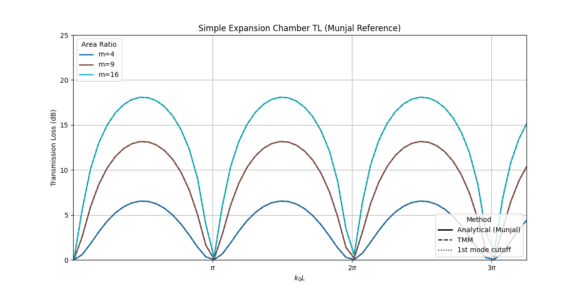
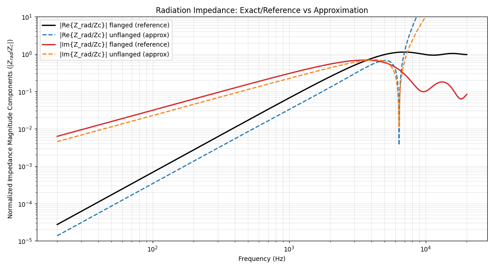
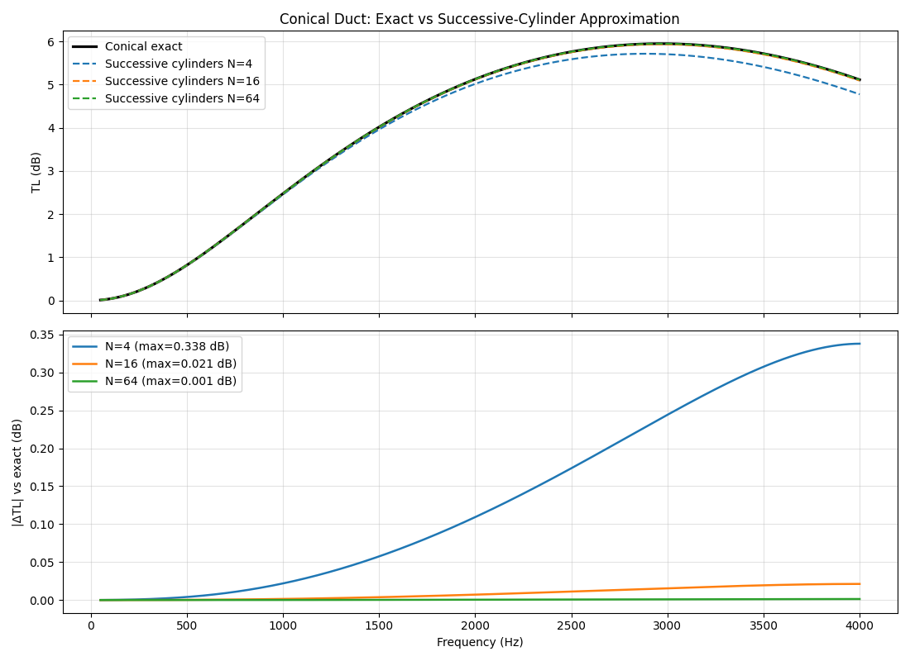

## Phase 1 Report Note

Phase 1 corresponds to the initialization of the project and to the first implementation of the core Transfer Matrix Method engine. In the overall logic of the original project plan, this stage provides the foundation on which all later earplug simulations are built. The objective was to establish the basic toolbox architecture and to validate a first set of canonical acoustic elements derived from **Munjal, _Acoustics of Ducts and Mufflers_**.

At this stage, the focus is deliberately restricted to elementary but essential one-dimensional components:

1. the abstract `AcousticElement` interface and matrix-composition logic,
2. the lossless cylindrical duct,
3. the exact conical duct formulation,
4. abrupt impedance discontinuities,
5. radiation impedances,
6. and standard terminal loads such as rigid and matched terminations.

This phase is therefore not yet an earplug model in itself. Its role is to verify that the elementary transfer-matrix blocks behave correctly before more complex dissipative, porous, structural, or identified elements are introduced.

### `B0_munjal_muffler_TL.py`

This script validates the implementation of the basic cylindrical duct element together with the standard transmission-loss formulation. The comparison is performed directly against the reference formulas and graphical results from Munjal. The agreement confirms that the lossless duct matrix and the associated TL post-processing are implemented consistently.

  

### `B1_radiation_impedance_flanged_unflanged.py`

This script implements and checks the flanged and unflanged radiation impedances. The objective here is not only to reproduce the expected frequency dependence, but also to verify the correct asymptotic behavior of the normalized piston radiation impedance. In particular, the exact formulation is checked so that the normalized real part tends toward its expected limit.

  

### `B1_TL_conical_exact_vs_discretized.py`

This script compares the exact conical duct formula from Munjal with a discretized approximation obtained by cascading many small cylindrical segments. The result validates both the exact conical implementation and the consistency of the composition engine, while also showing that duct discretization can be used as a practical approximation route when needed.

  

## Conclusion

Phase 1 establishes the minimal core of the toolbox. The first elementary acoustic components were implemented and validated against analytical formulas and reference results from Munjal. This phase confirms that the project starts from a sound transfer-matrix foundation, which is essential before moving toward more realistic earplug-specific models involving losses, geometry variations, films, porous materials, and system-level insertion-loss predictions.
