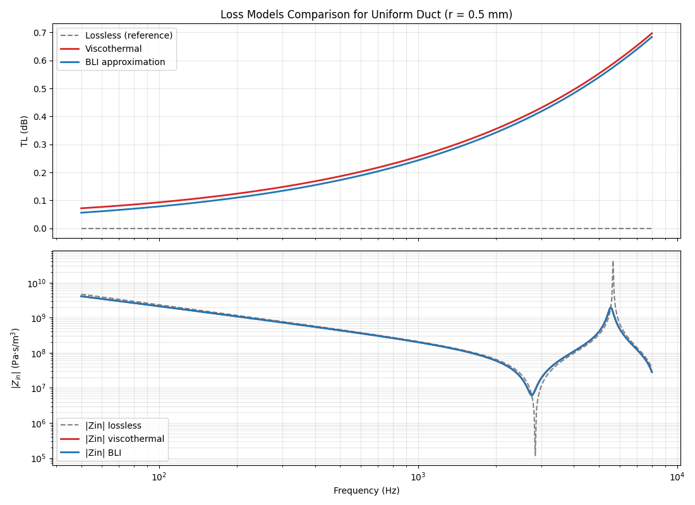
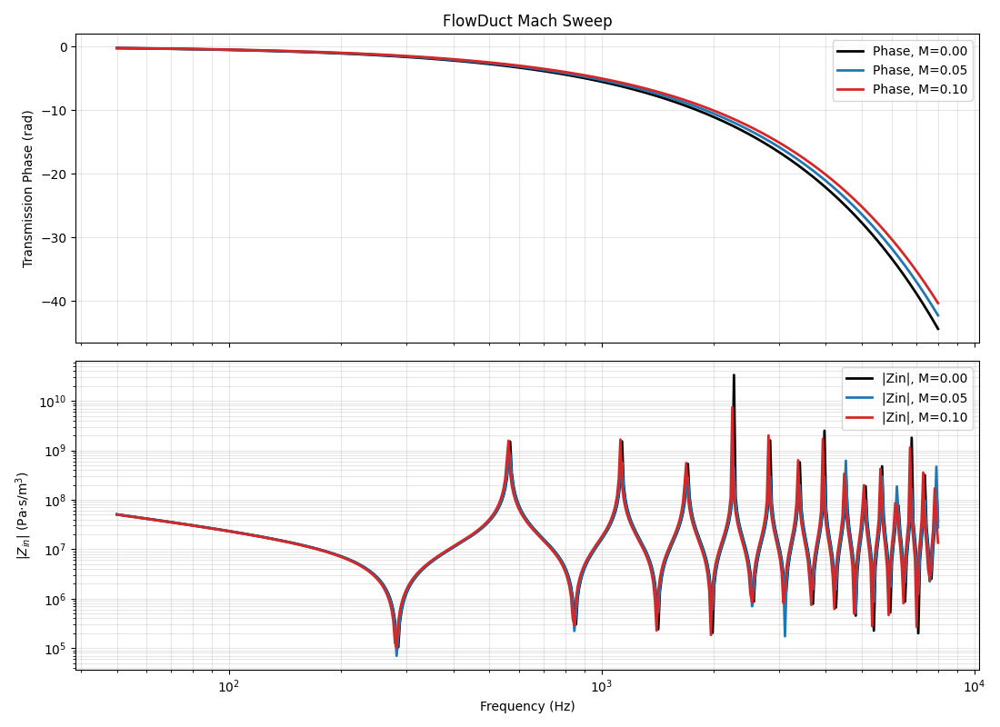
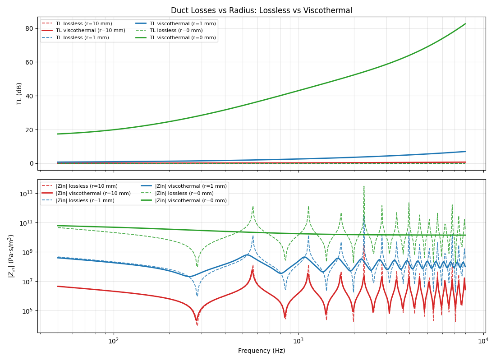
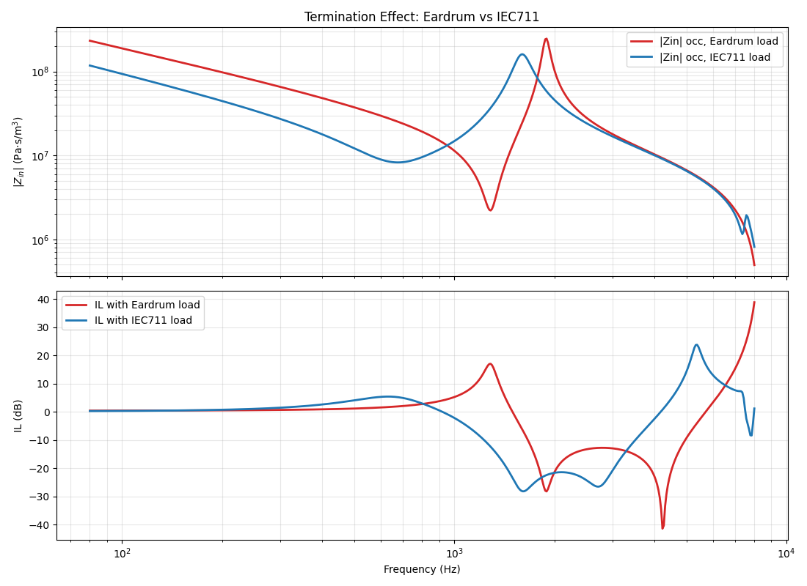

## Phase 2 Report Note

Phase 2 extends the minimal TMM engine established in Phase 1 by introducing the first dissipative mechanisms required for realistic earplug simulations. In the original project logic, this is the stage where the framework moves beyond purely lossless textbook elements and starts incorporating the physical effects that are essential in narrow ducts and ear-canal-scale geometries.

The main objective of this phase is to implement and validate:

1. viscothermal losses in narrow ducts,
2. a lighter boundary-layer-inspired approximation for faster use when appropriate,
3. mean-flow effects through a convected duct model,
4. and realistic terminal loads relevant to ear acoustics, in particular the eardrum and IEC711 coupler impedances.

This phase is important because earplug behavior cannot be interpreted correctly from lossless propagation alone. In small bores and short ear-canal-like segments, viscous and thermal boundary-layer effects strongly influence both attenuation and phase.

### `B0_compare_loss_models_r0p5mm.py`

This script compares different loss models for a very small-radius duct, in a regime where viscothermal effects are expected to be dominant. The purpose is to verify that the newly introduced dissipative formulations produce physically meaningful attenuation and dispersion trends, and to assess the differences between simplified and more complete models in a strongly confined configuration.

  

### `B1_flowduct_mach_sweep.py`

This script validates the convected duct formulation by sweeping the Mach number and checking the effect of mean flow on the transfer response. It also confirms the required consistency condition that the flow model reduces to the standard cylindrical duct when the Mach number tends to zero.
It's bit out of scope but it was easy extension that might become handy in another project using tmm + flow.

  

### `B2_viscothermal_duct_vs_lossless_radius_sweep.py`

This script compares viscothermal and lossless duct models over a range of radii. Its main role is to show clearly when the lossless approximation becomes insufficient and when dissipative modeling becomes necessary. This is especially relevant for earplug filters and narrow ear-canal-like bores, where the transition from weak to strong thermoviscous influence occurs rapidly as the radius decreases.

  

### `B3_load_comparison_tm_vs_iec711.py`

This script compares different downstream load models, in particular a tympanic-membrane-type load and the IEC711 coupler termination. 
Originally the part here were both place holder but in the end only IEC711 was truly implemented from different paper. The eardrum impedance is still a placeholder as i didn't look  for meaningfull implementation yet.

  

## Conclusion

Phase 2 introduces the first dissipative and load-dependent ingredients required for credible earplug simulations. The viscothermal duct, simplified dissipation approximation, convected duct, and ear-relevant terminations were implemented and checked through dedicated comparison scripts. Together with the Phase 1 core engine, these developments establish a more realistic basis for later work on ear-canal acoustics, filter elements, insertion loss, and COMSOL/TMM validation.
