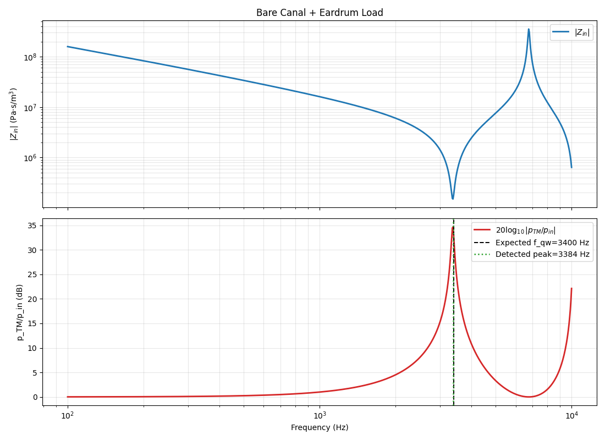
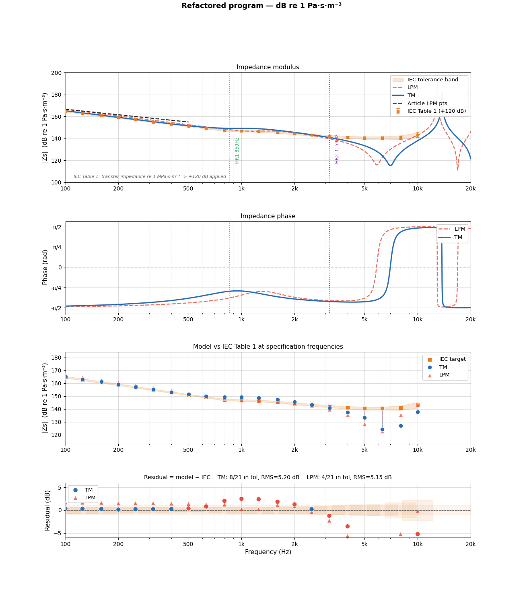
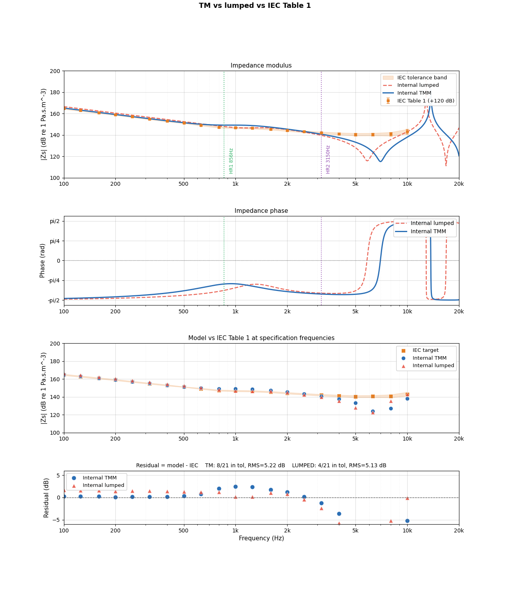

## Phase 3 Report Note

Phase 3 introduces the first geometry-driven ear-acoustic configurations in the project. After the implementation of the core TMM engine in Phase 1 and the inclusion of dissipation and relevant terminations in Phase 2, this stage begins to connect the toolbox to configurations that are directly meaningful for earplug and ear-canal acoustics.

The objective of this phase is to study how simple canal-like geometries and standardized ear-simulator geometries shape the acoustic response. In particular, this phase focuses on quarter-wave effects, IEC60318-4 / IEC711-style representations, and the first comparisons between simplified geometrical models and more realistic internal ear-acoustic layouts.

The detailed theory associated with the IEC implementation is documented separately in `../../Theory/A3_phase3_geometry/iec_tmm.md` and `../../Theory/A3_phase3_geometry/IEC60318_4_LPM_theory.md`, which provide the full background for the TMM and lumped-parameter-model representations used in this phase.

### `B0_bare_canal_quarter_wave_resonance.py`

This script illustrates the most basic ear-canal use of the framework. The system is built as a canal geometry terminated by an end impedance, and the pressure at the downstream end of the canal is computed from an imposed incident pressure. In that sense, it already captures the essential logic of the later insertion-loss calculations: build the acoustic system, apply a load, and compute the pressure response at the ear side.

The configuration is intentionally simple and highlights the quarter-wave resonance of a bare canal-like geometry. This is an important baseline for the rest of the project, because later occluded, filtered, or coupled-earplug responses can only be interpreted properly if this unoccluded resonance behavior is already understood.

  

  

### `B1_iec4_tmm_external.py`

This script implements a reduced TMM representation of the IEC60318-4 / IEC711 ear simulator following the model proposed by Luan et al. (2021), together with the corresponding lumped-element circuit interpretation of the same standard. The script is self-contained and serves as a first direct validation of the IEC ear-simulator representation outside the internal framework architecture.

Its role is to show that the toolbox can reproduce not only simple ducts, but also a standardized reference ear-side load that is widely used in measurement practice. The comparison between the TMM version and the lumped counterpart gives a response that is very close to the published reference. A small discrepancy remains in some values, but the overall agreement is sufficient to support the continuation of the project. A later comparison against the freely available COMSOL IEC model could still be useful as an additional validation step.

  

### `B2_iec4_tmm_internal.py`

This script reproduces the same IEC60318-4 / IEC711 study as `B1_iec4_tmm_external.py`, but now within the internal project framework. In other words, the objective is no longer only to reproduce the external model, but to confirm that the same behavior is obtained once the implementation is integrated into the toolbox itself and made reusable for later developments.

This internal version is therefore a structural validation step. It confirms that the IEC model can be called as a normal framework component and that it remains consistent with the external self-contained version. This is important because the IEC711 load is used repeatedly in the later earplug and filter simulations, especially in insertion-loss studies and optimization work.

  

## Conclusion

Phase 3 provides the first bridge between elementary TMM components and ear-specific acoustic configurations. It validates both the bare-canal quarter-wave behavior and the reduced TMM representation of the IEC60318-4 / IEC711 ear simulator. This phase is therefore a key step in moving from generic duct acoustics toward earplug-relevant system modeling, where canal geometry and standardized ear-side loading become central.
