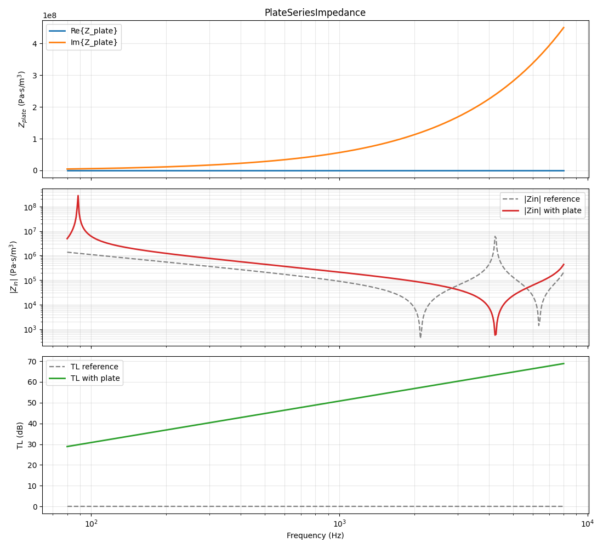
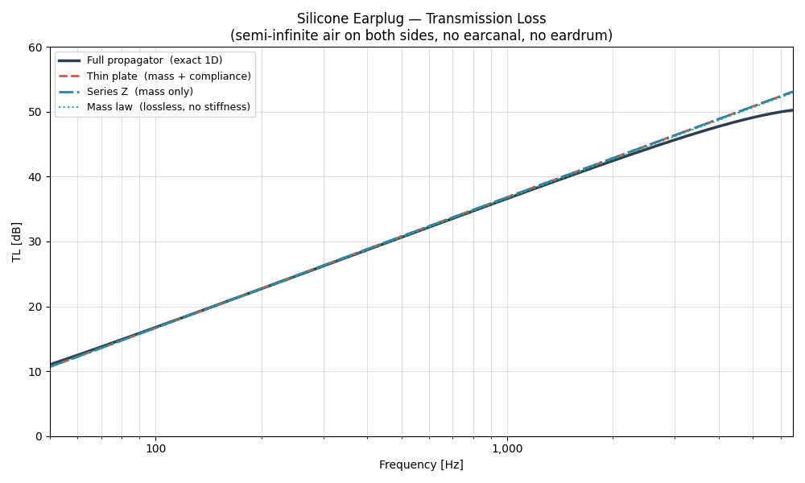
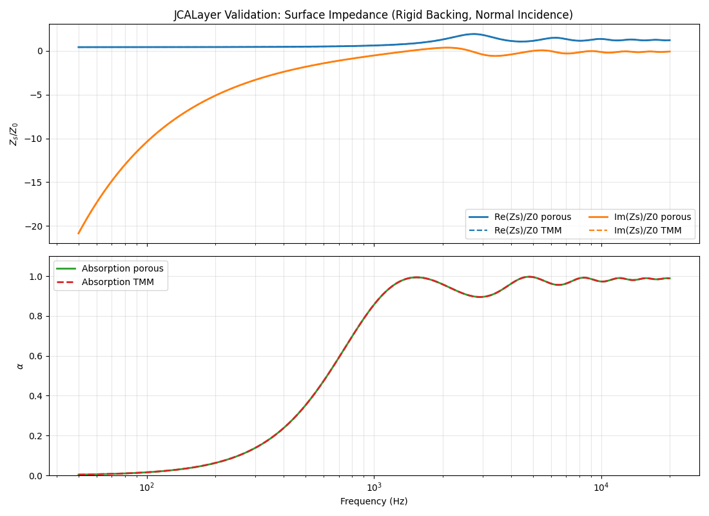
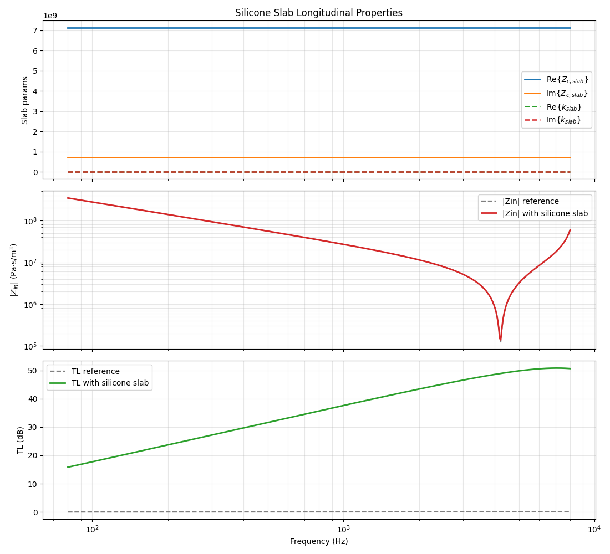
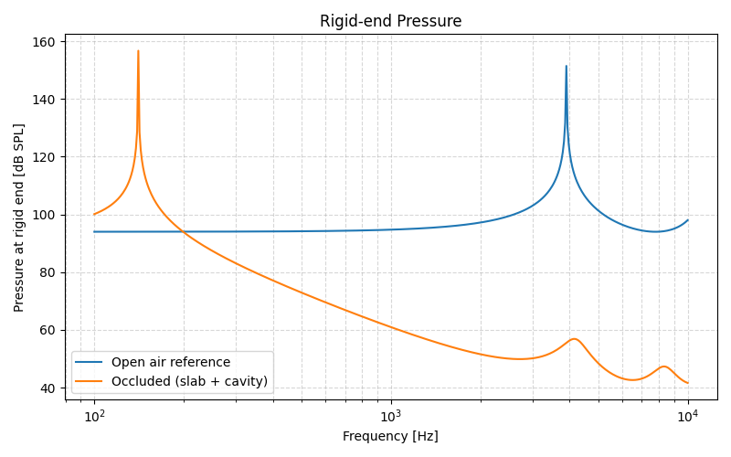
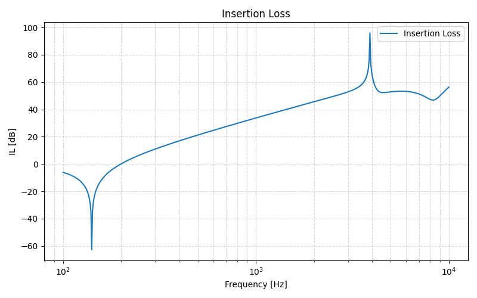

## Phase 5 Report Note

Phase 5 marks the transition from elementary duct acoustics toward coupled structural and material subproblems that are directly relevant to the earplug concept. After the implementation of the core propagation engine, dissipation, and basic geometrical reference cases, this phase introduces plate-like elements, slab responses, and porous-layer validations.

The initial expectation at this stage was that, once slabs, plates, and porous layers were available, most of the ingredients required to simulate the earplug would already be in place, aside from the final film element. In practice, this phase became an integration step: bringing these different elementary components into the internal framework, checking that their responses were physically reasonable, and testing whether they could support a full TMM representation of the earplug.

This phase also marks an important turning point in the project. It is here that the silicone slab problem began to appear as a fundamental limitation of the straightforward one-dimensional TMM approach. The low-frequency blocking behavior expected from a sealed silicone slab was not reproduced correctly, which suggested that the simple 1D representation was missing an essential part of the physics. This realization later motivated the shift toward stronger FEM validation and element-by-element verification.

### `B1_thinplate_response.py`

This script introduces the thin-plate element inside a duct and compares the corresponding transmission loss with and without the plate. Its role is to verify that a compliant structural element can be inserted into the TMM chain and produces a physically interpretable change in the acoustic response.

  

### `B2_comparison_of_plate_implementation_external.py`

This script is a self-contained implementation of several TMM plate models using different approximations. The purpose is to compare their responses and verify that they produce the same overall behavior, with differences appearing mainly in the higher-frequency range. This is useful because lower-order approximations may remain sufficient and more convenient in practice when the accuracy requirements are moderate.

  

### `B3_comparison_of_plate_implementation_internal.py`

This script performs the same comparison as the previous one, but after moving the implementation into the internal project framework. Its role is to confirm that the refactored internal code remains consistent with the external validation version.

### `B4_jca_layer_validation_vs_toolkitsd_porous.py`

This script adapts the already existing Miki and JCA material descriptions into a layer-in-duct representation and compares them with the `toolkitsd.porous` reference implementation. Its purpose is to validate the internal equivalent-fluid layer model before using it in more complex earplug configurations.

  

### `B5_Slab_duct_response.py`

This script studies the response of a slab inserted in a duct configuration. At first sight, the resulting transmission-loss behavior appeared reasonable, but the interpretation remained puzzling. This script should therefore be understood as an intermediate step: it suggested that the slab model could be inserted into the TMM chain, but it did not yet confirm that the resulting low-frequency behavior was physically correct for the earplug problem.

  

### `B6_simple_slab_cavity_code_tmm.py`

This script was introduced to examine the slab in a more directly earplug-relevant configuration by computing insertion loss for a rigidly terminated slab-cavity system. This test clarified the issue observed in the previous script: instead of behaving mainly as a low-frequency blocking element, the slab behaved more like an acoustic mass. This conflicts with the expected behavior of a sealed silicone earplug, which should strongly impede low-frequency transmission.

This was a decisive result. It showed that the problem was more complicated than initially expected, and that the whole earplug could not simply be modeled as a straightforward 1D TMM assembly using the slab representation available at that point. This insight directly motivated the later change in the work breakdown and the stronger reliance on FEM-supported validation.

  

  

## Conclusion

Phase 5 introduces the first structural and porous submodels required for realistic earplug elements and validates their integration into the internal framework. At the same time, it reveals a major limitation of the naive slab-based TMM representation: the silicone slab does not reproduce the expected low-frequency blocking behavior. This negative result is one of the most important outcomes of the phase, because it triggered the methodological shift toward stronger FEM comparison, matrix identification, and more careful validation of each reduced model before reuse in the complete earplug problem.
