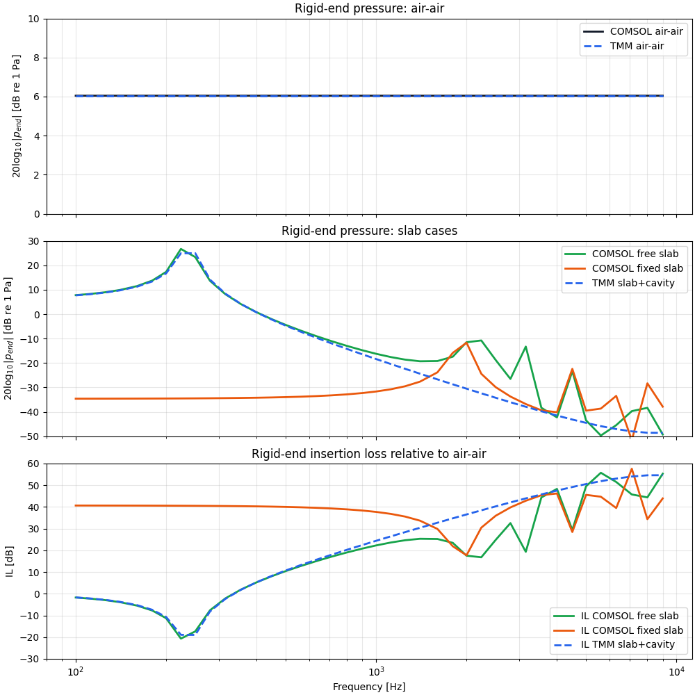

Technical note — interpretation of the slab-model discrepancy

---

# Technical note — interpretation of the slab-model discrepancy

## 1. Purpose of the comparison

The objective of this study was to clarify the origin of the discrepancy between a reduced $1\text{D}$ transfer-matrix model (TMM) of a silicone slab and finite-element simulations performed in COMSOL for the configuration:

air $\rightarrow$ silicone slab $\rightarrow$ air cavity $\rightarrow$ rigid termination.

The comparison was carried out on the same observable quantities:

* rigid-end pressure $p_{\mathrm{end}}(f)$,
* rigid-end velocity or volume velocity,
* insertion loss relative to the air-air reference,
  $IL(f)=20\log_{10}\left(\left|p_{\mathrm{end,ref}}/p_{\mathrm{end}}\right|\right)$.

The key point of the démarche is that the **air-air reference first validates the comparison chain itself**: source convention, rigid-end condition, pressure extraction, and TMM implementation. In the air-air case, COMSOL and TMM are essentially identical, which shows that the discrepancy does **not** come from the rigid-end post-processing or from the basic $1\text{D}$ acoustic propagation model. It appears only once the elastic slab is introduced. This is therefore a **modeling discrepancy of the slab physics and boundary conditions**, not a basic implementation error. 

---

## 2. Reminder of the TMM model used

In the TMM description, the system is represented by a $2\times2$ transfer matrix relating the acoustic state vector

$ \begin{bmatrix} p \\ U \end{bmatrix} $

between the inlet and the outlet of each element. For one layer,
$ \begin{bmatrix} p_{\mathrm{in}} \\ U_{\mathrm{in}} \end{bmatrix}=
\begin{bmatrix} A & B \\ C & D \end{bmatrix}
\begin{bmatrix} p_{\mathrm{out}} \\ U_{\mathrm{out}} \end{bmatrix}. $

For a uniform duct, the classical plane-wave matrix is

$ \mathbf{T}_{\mathrm{duct}} =
\begin{bmatrix}
\cos(kL) & j Z_c \sin(kL) \\
j \sin(kL)/Z_c & \cos(kL)
\end{bmatrix}. $

The elastic slab is described in the same algebraic form, but with an effective longitudinal wave number $k_s$ and characteristic impedance $Z_s$ derived from the slab material model. The slab+cavity system is then written as

$ \mathbf{T}*{\mathrm{tot}} = \mathbf{T}*{\mathrm{slab}} \mathbf{T}_{\mathrm{cavity}}. $

At the rigid termination, the outlet volume velocity is zero:

$ U_{\mathrm{out}}=0. $

Therefore, if

$ \begin{bmatrix} p_{\mathrm{in}} \ U_{\mathrm{in}} \end{bmatrix}=
\begin{bmatrix} A & B \\ C & D \end{bmatrix}
\begin{bmatrix} p_{\mathrm{end}} \\ 0 \end{bmatrix}, $

then

$ p_{\mathrm{end}} = \frac{p_{\mathrm{in}}}{A}. $

The inlet total pressure is not imposed directly as a constant; it is obtained from the incident-wave amplitude via the acoustic impedance divider, so the TMM comparison remains consistent with the source convention used in the script. This modeling framework is exactly the one summarized in the project note. 

---

## 3. What the comparison shows

### 3.1 Air-air case

The air-air case shows excellent agreement between COMSOL and TMM over the considered frequency range. This is an important validation result: it confirms that the reference cavity acoustics, the rigid-end extraction, and the source/load treatment are mutually consistent.

### 3.2 Slab cases

Once the silicone slab is inserted, the three curves separate:

* the **COMSOL free-slab** case remains close to the TMM result at low frequency,
* the **COMSOL fixed-slab** case exhibits a much lower rigid-end pressure,
* therefore the corresponding **fixed-slab IL is much higher**.

At higher frequencies, additional discrepancies appear between TMM and COMSOL free-slab. At this stage they should be interpreted with caution: they may come from mesh quality, numerical resolution, sensitivity to local boundary details, and the increasing limitations of a purely $1\text{D}$ slab representation once the wavelength in the slab decreases. That part is not yet sufficient to conclude on the physical model alone.

---

## 4. Why standard TMM is not equivalent to fixed-constraint COMSOL

This is the central point.

In COMSOL, a fixed constraint means a true mechanical boundary condition:

$ \mathbf{u} = 0 $

on the constrained boundary. The material is kinematically clamped there: no radial motion, no axial motion, and no tangential motion are allowed. This is a **local displacement constraint** imposed directly in the solid mechanics model. 

By contrast, a standard slab TMM is a **reduced $1\text{D}$ propagation model**. It assumes that the slab can be represented as a uniform longitudinal layer characterized by an effective wave number and an effective characteristic impedance. The model describes how averaged pressure and volume velocity propagate through the layer, but it does **not** explicitly impose a mechanical clamp on the lateral boundary of the solid. 

This is why “slab in a rigid duct” in TMM and “fixed constraint” in COMSOL are not the same statement:

* in TMM, “rigid duct” mainly means a waveguide assumption and $1\text{D}$ confinement of the acoustic field,
* in COMSOL, “fixed constraint” means a solid-mechanics displacement clamp.

These are related notions, but they are not equivalent. A TMM with a stiffer effective modulus may mimic a more confined medium, but this still modifies the **constitutive response**, not the **boundary condition** itself. In other words, it may become “closer” to a laterally constrained slab, but it is still not the same physical model as a fixed FEM constraint.

So the correct interpretation is:

> the standard slab TMM is a reduced internal model of a longitudinally propagating plug, whereas the COMSOL fixed-slab model is a mechanically clamped solid with potentially richer stress, shear, and confinement effects.

This explains why agreement with the free-slab case can be acceptable at low frequency, while agreement with the fixed-slab case is not expected.

---

## 5. Why fixed walls tend to overestimate low-frequency IL

The low-frequency trend now becomes physically understandable.

At low frequency, the response is dominated by the global compliance of the occluding system. If the slab side walls are free, the silicone can deform more easily. Part of the excitation is accommodated by lateral deformation and a more compliant overall motion. The slab therefore transmits more motion to the trapped air cavity, which keeps the rigid-end pressure comparatively higher and the resulting insertion loss lower.

If instead the side wall is fixed, the silicone is mechanically confined. Its deformation is restricted, so the effective stiffness of the occluding system increases. The slab behaves as a much less compliant plug, transmits less cavity compression, and the pressure at the rigid end decreases. Since the IL is computed relative to the same air-air reference, a lower $|p_{\mathrm{end}}|$ directly produces a larger IL:

$ IL = 20\log_{10}\left(\frac{|p_{\mathrm{end,air-air}}|}{|p_{\mathrm{end,slab}}|}\right). $

So the fixed-constraint model naturally yields a larger low-frequency IL than the free-slab model.

This is exactly the tendency observed in your results: at low frequency, the TMM and free-slab COMSOL pressures remain close, while the fixed-slab pressure is much lower and therefore its IL is much larger.

This interpretation is also consistent with the literature summary you collected: the overly rigid lateral-wall assumption tends to overestimate low-frequency insertion loss, whereas introducing a deformable surrounding skin leads to more realistic low-frequency behavior. In the summarized note, the deformable artificial skin is reported to significantly affect IL below about $0.8$–$1,\mathrm{kHz}$, and the rigid-wall approximation is explicitly identified as overestimating low-frequency IL.

---

## 6. Interpretation of the present figure

The figure can therefore be interpreted in three stages.

First, the air-air agreement validates the overall comparison framework. It shows that the source convention, rigid-end condition, pressure extraction, and basic acoustic propagation treatment are mutually consistent in both COMSOL and TMM.

Second, in the slab case, the low-frequency agreement between the TMM and the free-slab FEM configuration indicates that the standard slab TMM behaves like a simplified longitudinal plug model with relatively unconstrained lateral deformation. This is useful as a reduced-order approximation, but it does not fully capture the mechanical confinement effects that are present in a more realistic earplug configuration.

Third, the fixed-constraint FEM case should not be interpreted as showing that the TMM is correct and FEM is “different”; rather, it highlights that the **standard slab TMM is not sufficient to accurately represent the real physical behavior of the occluding silicone element**. The FEM formulation is closer to reality because it explicitly resolves the solid mechanics and the interaction between slab deformation and cavity loading. However, a fully fixed lateral constraint is itself still an idealization: it tends to make the slab too stiff and therefore slightly overestimates the low-frequency insertion loss. A more realistic human configuration would likely be obtained in FEM by introducing an intermediate compliant layer, for example a skin-equivalent layer, between the silicone and the rigid support. This would preserve the advantage of the FEM mechanical description while reducing the artificial over-confinement of the fully fixed case.

---

## 7. Practical conclusion for the roadmap

The main conclusion of this work package is the following:

1. The comparison chain is validated by the air-air case.
2. The discrepancy in the slab case is primarily due to **boundary-condition mismatch**, not to a basic TMM error.
3. A standard elastic-slab TMM can not be used straight for the sake of earplug IL simualtion
4. A fixed-constraint FEM slab is expected to **overestimate low-frequency IL** because the clamp artificially stiffens the occluding system.
5. If one wants to represent the fixed or realistic confined case in a reduced-order model, the next step is not to reuse the standard slab matrix unchanged, but to identify an **equivalent frequency-dependent transfer matrix** from FEM, or from measure which is the approach taken in :
'An impedance tube technique for estimating the insertion loss of earplugs' K. Carillo

---
