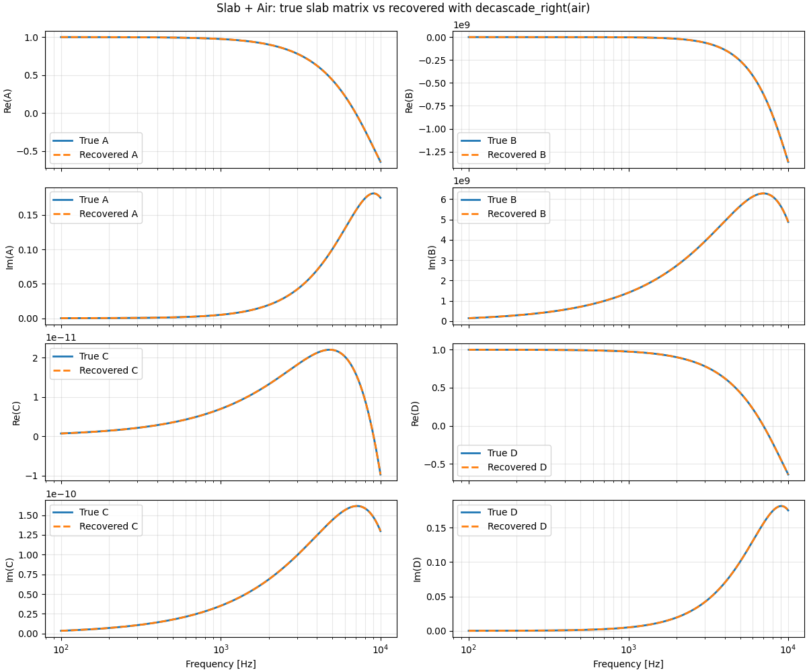

## WBS 4 Report Note

WBS 4 focuses on the **de-embedding** of the surrounding air sections from a globally identified two-port system. In the updated project plan, the objective of this work package is to isolate the slab response from the upstream and downstream air domains so that the equivalent matrix of the slab itself can be analyzed and reused independently of the surrounding test geometry.

In practice, this work is closely connected to WBS 2, because de-embedding is only meaningful once the port quantities, transfer-matrix convention, and sign convention have been fixed consistently. For that reason, the implementation of WBS 4 naturally follows the port-based framework established earlier.

The central idea is simple: if a total system is made of a known upstream air section, the unknown slab, and a known downstream air section, then the slab matrix can be recovered by removing the known air contributions through inverse cascade operations. In the codebase, this corresponds to the introduction of an **uncascade / decascade** operation acting directly on TMM objects or on identified matrices.

This step is important because it separates two questions that would otherwise remain mixed:

1. the physics of the slab itself,
2. the influence of the surrounding air domains used in COMSOL or in the test bench.

### `B1_minimal_port_matrix_inversion.py`

This script provides the minimal validation of the decascading idea. A composed system is built from known elements, then the surrounding parts are removed through the inverse-cascade operation. The result shows that the recovered element is identical to the original one that was embedded in the full system. This confirms that the de-embedding procedure is implemented correctly and can be trusted as a basic framework utility.

  

### `B2_regularized_two_load_inversion_lcurve.py`

This script explores the possibility of regularizing the inversion process through an L-curve strategy. At the present stage, the conclusion is that this regularization is not really needed for the current numerical cases, because the inversion remains sufficiently stable without it. However, the script is still useful as a methodological reserve, since regularization may become important later when moving from clean numerical data to noisier measurement-based identification.

## Conclusion

WBS 4 establishes the de-embedding capability needed to isolate slab-only responses from larger simulated systems. This is a key methodological step in the project, because it makes it possible to distinguish the equivalent response of the slab from the surrounding air sections and therefore to reuse the slab matrix in a cleaner and more interpretable way. Although the regularized inversion route does not appear necessary yet, the framework now contains the required tools for both direct decascading and more stabilized identification if future measurement data demands it.
