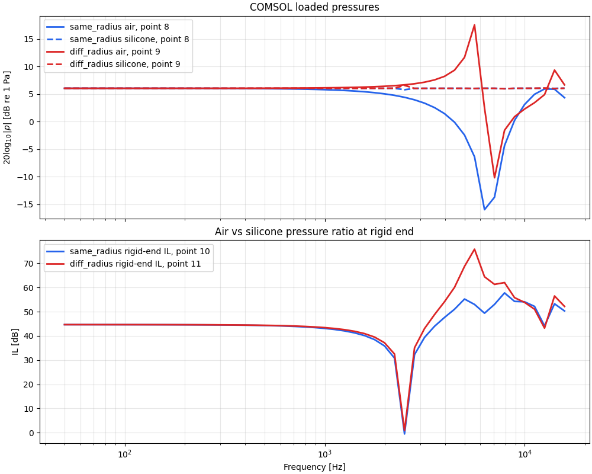
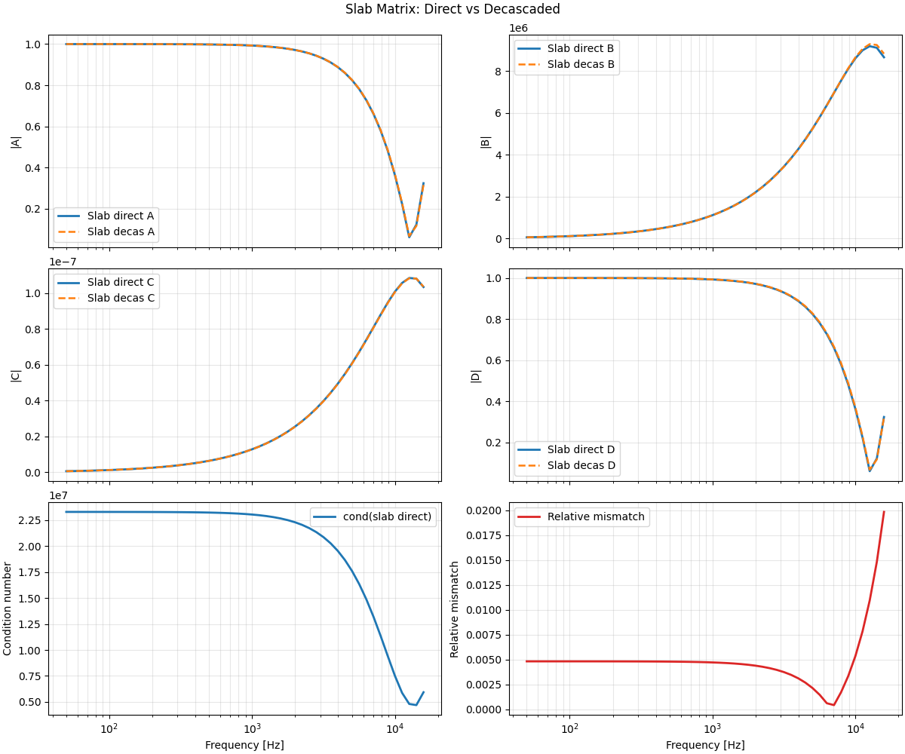
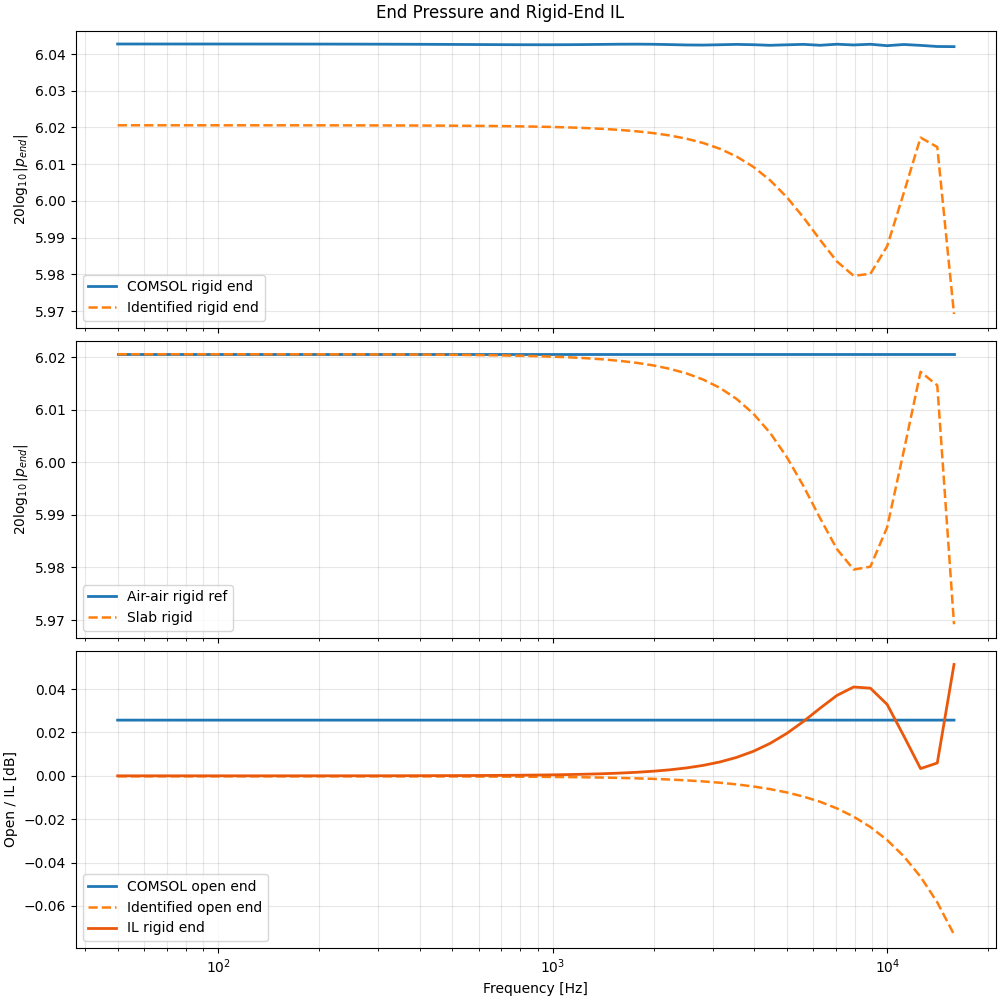
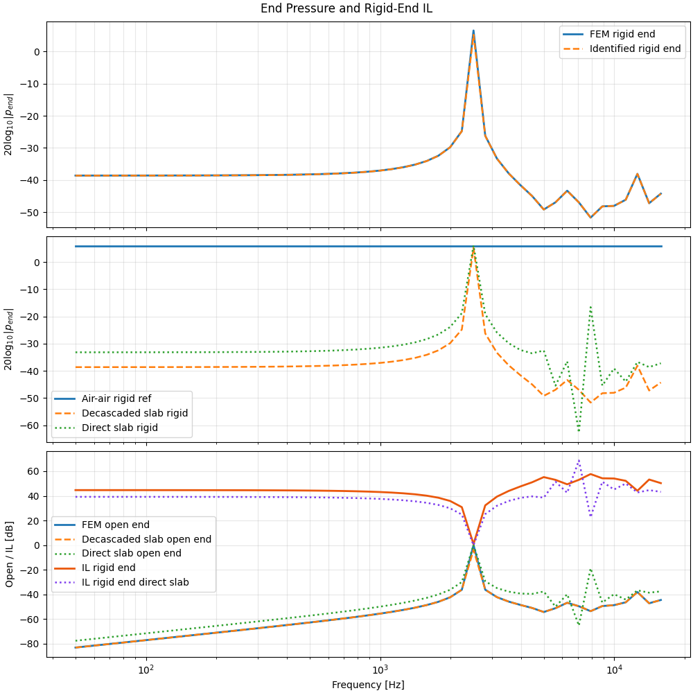
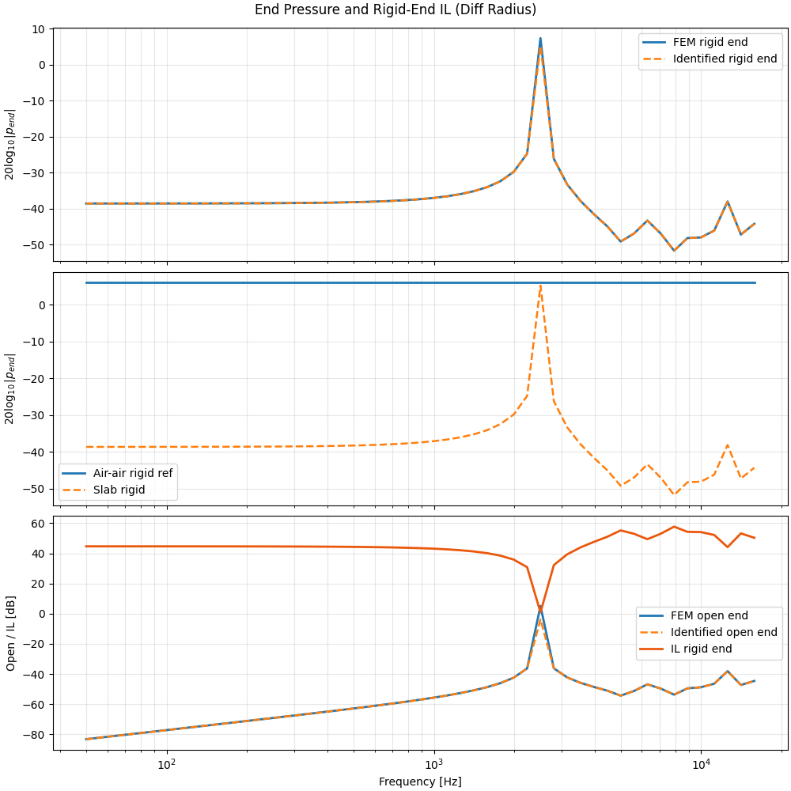
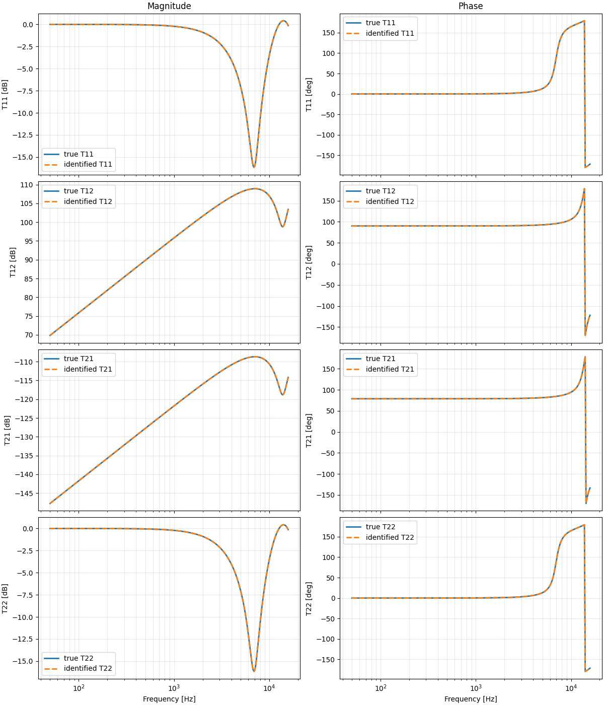
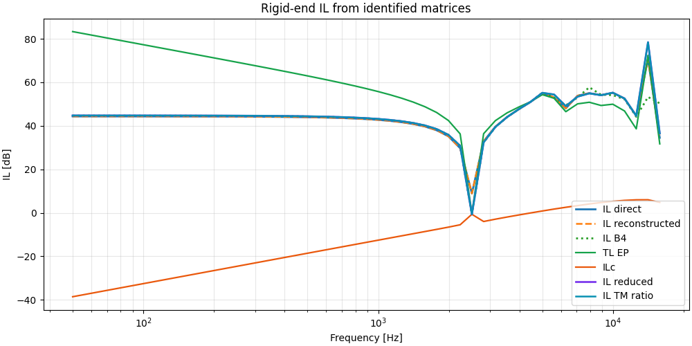

## WBS 5 Report Note

In practice, this folder gathers material from **WBS 3** and **WBS 5**, because both concern the identification of the slab or earplug response from load-dependent acoustic data. The objective is to move from full FEM simulations toward a reduced two-port description that can later be reused in insertion-loss calculations.

The first route explored here is the direct two-load inversion: identify the matrix from two different load cases, typically open and rigid terminations. This part is documented in `../../Theory/A9_wbs5/matrix_inversion.md` and is used as a validation route before moving to the second one: the Carrillo-style three-microphone method, focused on the quantities needed for insertion loss. Its theoretical basis is summarized in `../../Theory/A9_wbs5/IL_earplug_3mics_2load_theory.md`. This second method is the one intended for the experimental identification of the different elements used in the earplugs.

This work package also led to a practical result: the Carrillo paper `An impedance tube technique for estimating the insertion loss of earplugs` contains a missing factor $j$ in the reconstructed pressure expression. 

### `B1_IL_Tep_fromopen_rigid.py`

This script use FEM of a slab of silicone with an air cavity and estimates insertion-loss-related quantities directly from open and rigid load cases. It serves as a validation reduced IL route before the full three-microphone identification workflow is introduced.

  

### `B2_FEM_air_air_two_load_matrix_identification_same_radius.py`

This script validates the two-load matrix identification on the simplest same-radius air-air reference case. The identified matrix reproduces the rigid-end response very accurately, and the IL computed from the recovered matrix matches the IL obtained directly from the FEM end pressure.

  
  

### `B3_FEM_silicone_air_two_load_matrix_identification_same_radius.py`

This script applies the same two-load identification to the same-radius silicone-air case. The final IL reconstructed from the identified response agrees with the IL obtained directly from the FEM end pressure. A discrepancy remains between the directly identified slab element and the decascaded slab element, and this point remains unresolved, but it does not prevent the final IL comparison from working correctly.

  

### `B4_FEM_silicone_air_two_load_matrix_identification_diff_radius.py`

This script extends the previous identification to the diff-radius silicone-air configuration, which is closer to the geometry later used in the three-microphone / two-load method. The identification behaves consistently and the resulting IL reconstruction is satisfactory.

  

### `B5_tmm_simulation_two_load_3mic_identification_same_radius.py`

This script is a pure TMM self-consistency validation of the three-microphone / two-load method. The microphone signals are synthesized from a known TMM model, then the identification workflow is applied and compared against the exact slab matrix. The agreement is essentially exact. This script is quite bulky because it helped isolate the bug caused by the missing factor $j$ in the article.

  

### `B6_wb5_3mic_method_diff_radius_complete.py`

This script contains the full diff-radius three-microphone workflow using the FEM exported pressure. It reconstructs the boundary states, identifies the matrix, and checks the resulting quantities in detail. It is the most complete implementation of the method in this folder, and it includes many intermediate checks because of the debugging effort required during development (missing factor $j$ in the article.).

  

### `B7_wb5_3mic_method_diff_radius_minimal.py`

This script is the reduced version of the previous workflow. It keeps only the essential identification steps and provides a cleaner entry point to the method. Most of the remaining code length comes from loading and organizing the FEM exports rather than from the identification procedure itself.

## Conclusion

WBS 5 consolidates the identification part of the project. It combines direct two-load inversion, three-microphone reconstruction, and insertion-loss-oriented reduced quantities into one coherent workflow for recovering the effective response of the slab or earplug assembly. This work package is therefore a key bridge between full FEM simulations and the reduced models later used for interpretation, comparison, and design.
