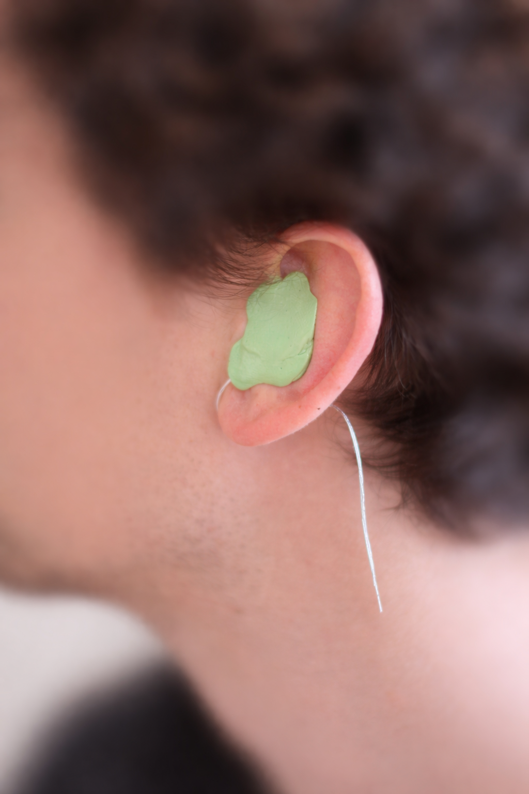
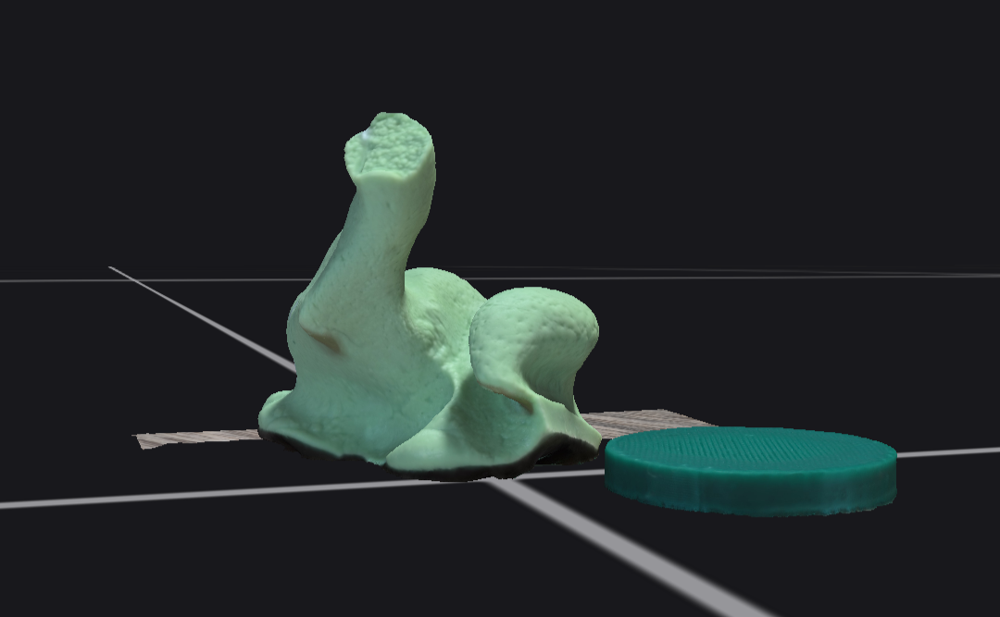
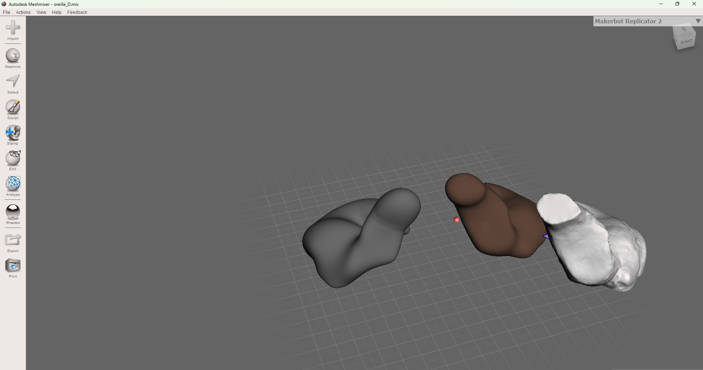
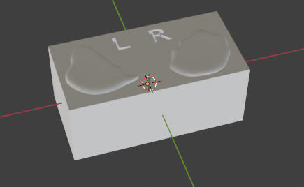
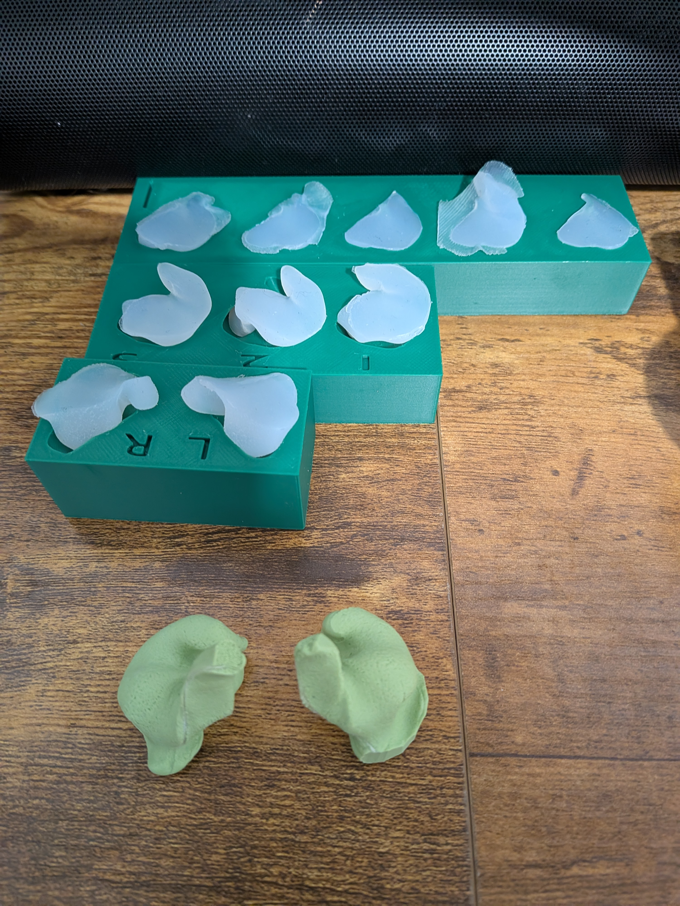
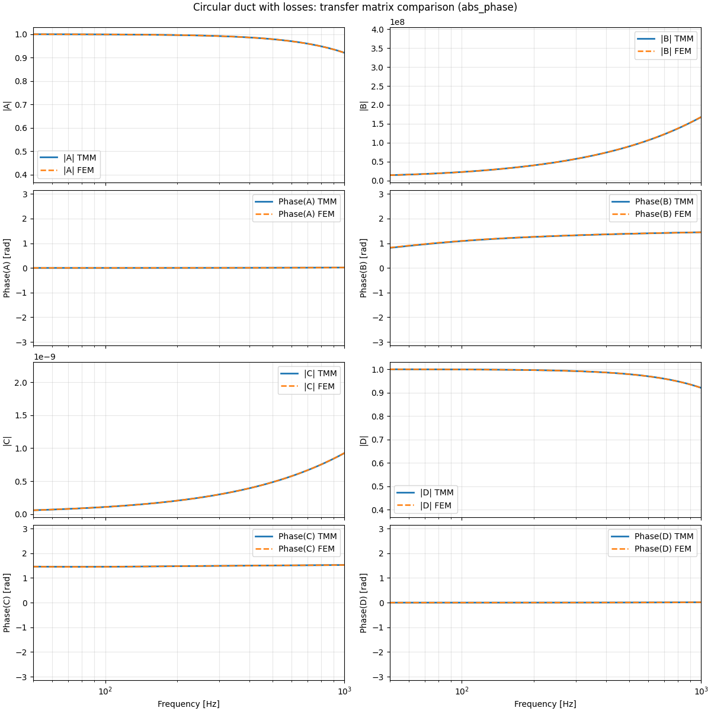
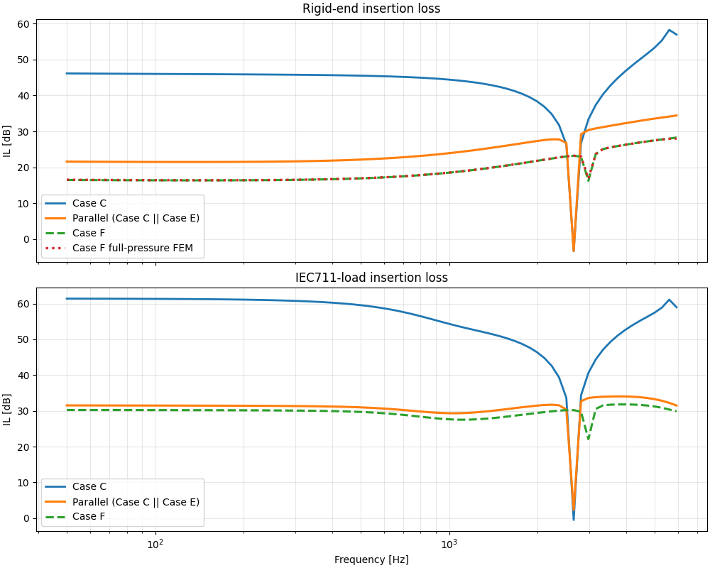
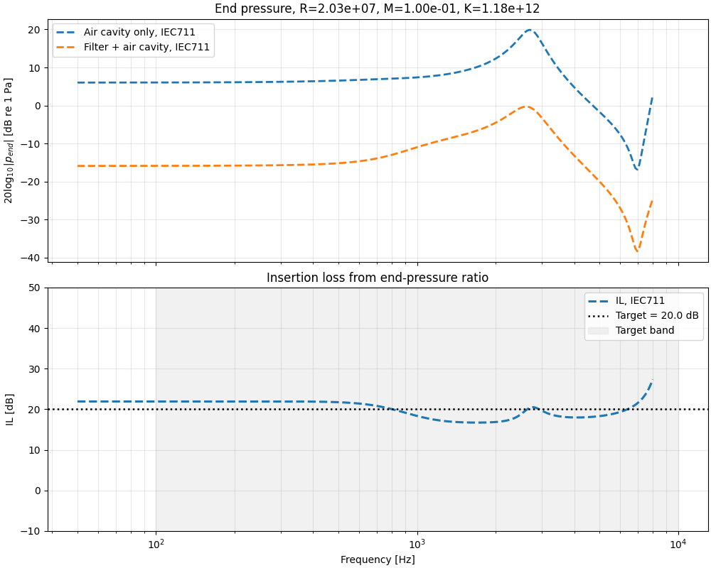
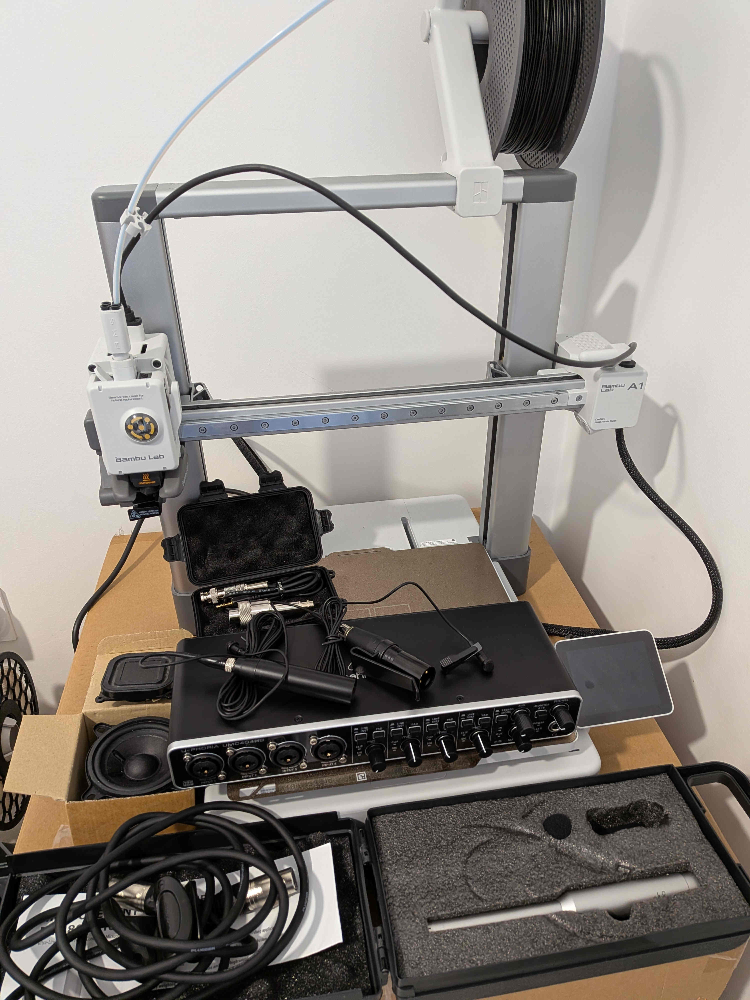

# Custom Earplug Project

This repository collects the main work packages of a custom earplug R&D project, from safe ear-impression preparation to geometry processing and reduced acoustic simulation.

The current structure is:

- `LOT1_Preparation_Validation_Protocol`: preparation, safety checks, and impression-taking protocol.
- `LOT2_Ear_Impressions`: first practical ear-impression trials and qualitative results.
- `LOT3&4_3D_modelling_and_silicone`: 3D acquisition, mesh cleanup, geometry iteration, and mold preparation.
- `LOT5_acoustic_filter_simulation`: reduced-order acoustic modeling, validation against FEM, and first filter optimisation studies.

Work packages 1 to 4 mainly document the DIY, fabrication, and process side of the project, while work package 5 contains the main R&D-grade simulation framework for earplugs. The balance is therefore intentionally uneven at this stage: the current release focuses more on sharing the acoustic modeling and validation work than on presenting a polished fabrication workflow. This will likely evolve as the project moves further toward experimental validation and production-oriented development.

## Project 1-4 workpackage in picture

From the impression protocol and first ear impressions to scan cleanup, Blender/Meshmixer processing, mold design, and silicone casting:







## Work Package 5 — R&D-Grade Earplug Simulation

Lot 5 corresponds to a full R&D-grade simulation framework for earplugs. It builds on a Transfer Matrix Method (TMM) approach in which each elementary component was progressively developed and validated against FEM simulations.

This work package also includes the implementation of advanced simulation approaches from the literature, notably:

* **Luan et al. (2021)**, *A Transfer Matrix Model of the IEC 60318-4 Ear Simulator: Application to the Simulation of Earplug Insertion Loss*, which introduces the IEC 60318-4 ear simulator as a load within a TMM framework for insertion loss estimation.

* **Carrillo et al (2024).**, *An impedance tube technique for estimating the insertion loss of earplugs*, which presents a three-microphone, two-load impedance tube method that will be addressed in the experimental part of the project.

The development of this section followed a structured WBS-based work package, which evolved progressively as new difficulties and modeling issues were identified. The full process is documented, from theoretical formulation to validation steps.

At this stage, the simulation framework enables efficient reduced-order modeling of earplug filters and their constituent elements, including, but not limited to:

* thin lossy tubes,

* Helmholtz resonators,

* section changes,

* flexural plates,

* membranes,

* resistive films,

and other building blocks relevant for the simulation and optimization of simplified earplug concepts.

The `Dev/` folder contains the step-by-step evolution of the simulation package. It provides a reproducible record of the main implementation stages, together with comments, intermediate results, and technical notes. Some parts reflect earlier assumptions or intermediate interpretations, since the physical modeling strategy evolved throughout the project.

The `Showcases/` folder contains simple example scripts illustrating how to use the simulation tools on representative cases.

The current limitation of the framework lies in the absence of the experimental phase, which is required to identify and calibrate realistic physical parameters for these elements. Once this part is completed, the model will be able to rely on experimentally grounded values and support more realistic predictive simulations.

## Release Status

This release should be understood as a research-grade prototype rather than a finished product.

- The reduced-order simulation framework in Lot 5 is already usable for validated exploratory studies.
- The repository documents real intermediate results and development history, not only polished final examples.
- The framework is not yet experimentally calibrated for final predictive use on fully realistic earplug configurations.

## Project Status

This repository should be read as an engineering notebook and prototype workflow rather than as a finished software package.

- Lots 1 to 4 document the physical acquisition and geometry side.
- Lot 5 is the main acoustic modeling contribution and the best technical entry point for code reuse.
- The simulation workflow is already usable for exploratory studies, but some reduced parameters are still effective fits rather than fully identified physical quantities.

### Limits and improovements

Although the codebase was developed following a class-based, object-oriented strategy, with systematic testing and FEM validation, many of the current example scripts could be turned into proper integration and non-regression tests. Refactoring in that direction would clearly improve the overall robustness and maintainability of the project.

Some of the latest work packages also rely on fairly cumbersome code. While this could definitely be improved, it reflects a common trade-off between rapid prototyping and over-engineered development. A cleanup phase would be valuable, but at this stage it seems more relevant to prioritize the experimental development rather than spend too much time polishing the simulation code.

## Quick Start With `uv`

The simulation code lives in [LOT5_acoustic_filter_simulation](./LOT5_acoustic_filter_simulation).

You need a working Python 3.12 installation for this release.

If `uv` is not installed yet, install it first:

```bash
python -m pip install uv
```

Create and activate a local environment:

```bash
uv venv --python 3.12 .venv
source .venv/bin/activate
```

Install the two core local toolkit packages in editable mode:

```bash
uv pip install -e LOT5_acoustic_filter_simulation/toolkitsd/Toolkitsd_porous
uv pip install -e LOT5_acoustic_filter_simulation/toolkitsd/Toolkitsd_acoustmm
uv pip install -e LOT5_acoustic_filter_simulation/toolkitsd/Toolkitsd_acoustic
```

Run one of the compact showcase examples:

```bash
uv run --active python LOT5_acoustic_filter_simulation/Codes_Earplugs/Showcases/A0_elementary_pieces/B0_rigid_duct.py
```

Run the optimisation showcase:

```bash
uv run --active python LOT5_acoustic_filter_simulation/Codes_Earplugs/Showcases/A2_optimisation/B0_RKM_joint_optimisation.py
```

If you want a quick smoke test without installing the packages first, the showcase scripts now also detect the local `toolkitsd/Toolkitsd_*/src` folders directly.

The `Showcases/` scripts are the recommended public entry points. The `Dev/` scripts preserve the research trail and validation history; they are useful for deeper inspection, but they should be treated as development notebooks rather than as the main user-facing interface.

## Suggested Reading Path

If you are here for the project story:

1. Start with [LOT5_acoustic_filter_simulation/README_dev.md](./LOT5_acoustic_filter_simulation/README_dev.md) for the simulation narrative.
2. Then open [LOT5_acoustic_filter_simulation/Codes_Earplugs/Showcases/README.md](./LOT5_acoustic_filter_simulation/Codes_Earplugs/Showcases/README.md) for runnable entry points.
3. Use [LOT5_acoustic_filter_simulation/Theory/](./LOT5_acoustic_filter_simulation/Theory/) for grouped theory notes.

If you are here for the full workflow:

1. Read Lot 1 for protocol and safety framing.
2. Read Lot 2 for the first impression trials.
3. Read Lots 3 and 4 for scan-to-geometry processing.
4. Finish with Lot 5 for the acoustic model and optimisation logic.

## Example Results

Lossy duct validation against FEM is one of the key reduced-model checks:



The slab-plus-filter assembly also showed where a simple parallel reduction stops being reliable:



The current framework already supports target-driven optimisation on reduced filter models:



## Perspectives and workpackage in dev

Lot 6 will cover the experimental phase, combining the development of the measurement architecture and the supporting tools: with an IEC 60318-4 coupler, ME2-type microphones, a 4-input sound card, and 3D printing  resources, the platform is intended to support both the construction of a three-microphone impedance tube and the  direct measurement of earplug insertion loss.


